# Monopoly Deal - Architecture Documentation

## Table of Contents
1. [System Overview](#system-overview)
2. [Component Architecture](#component-architecture)
3. [Data Flow](#data-flow)
4. [State Machine](#state-machine)
5. [Network Protocol](#network-protocol)
6. [Class Hierarchy](#class-hierarchy)

---

## System Overview

Monopoly Deal is a real-time multiplayer card game built with a client-server architecture using Socket.IO for bidirectional communication.

### High-Level Architecture

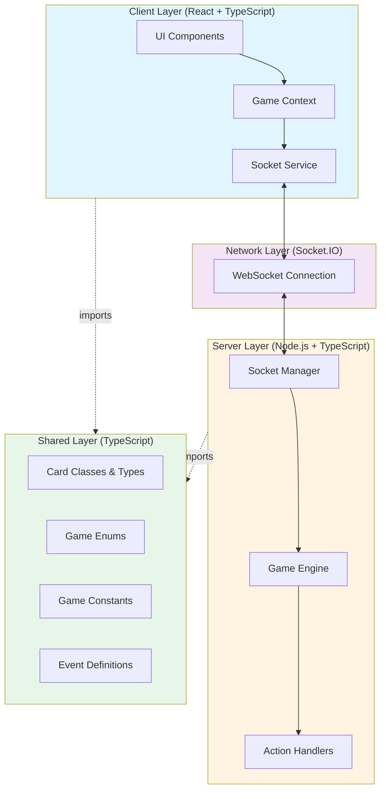

---

## Component Architecture

### Server Components

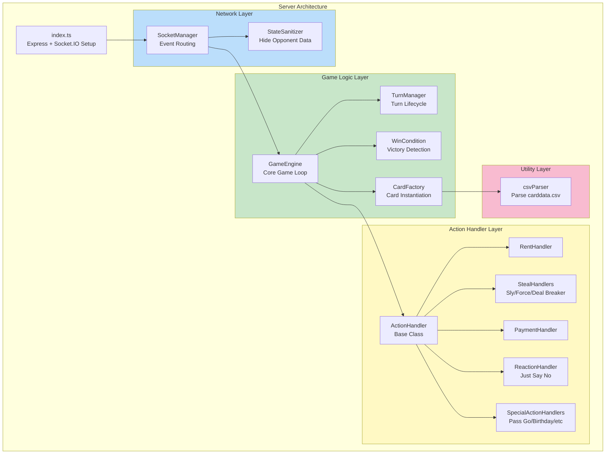

### Client Components

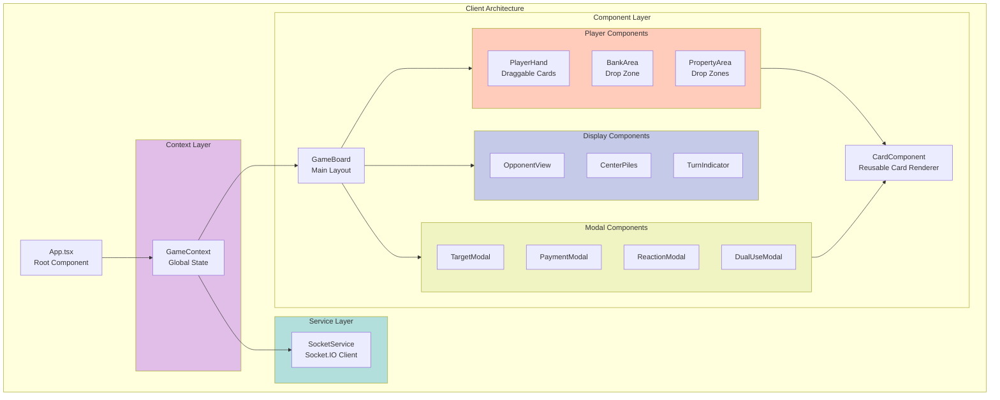

---

## Data Flow

### Game Action Flow

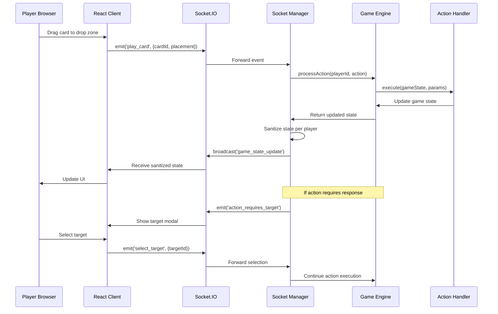

### State Synchronization Flow

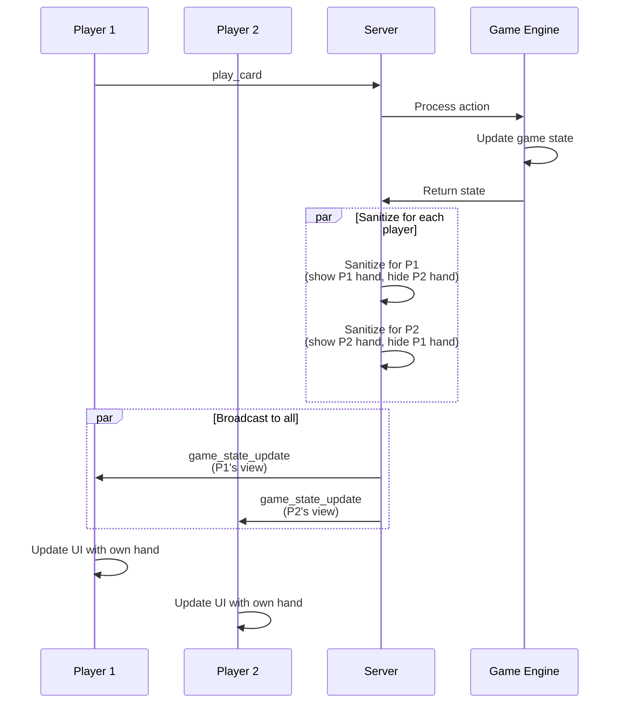

---

## State Machine

### Game Phase Transitions

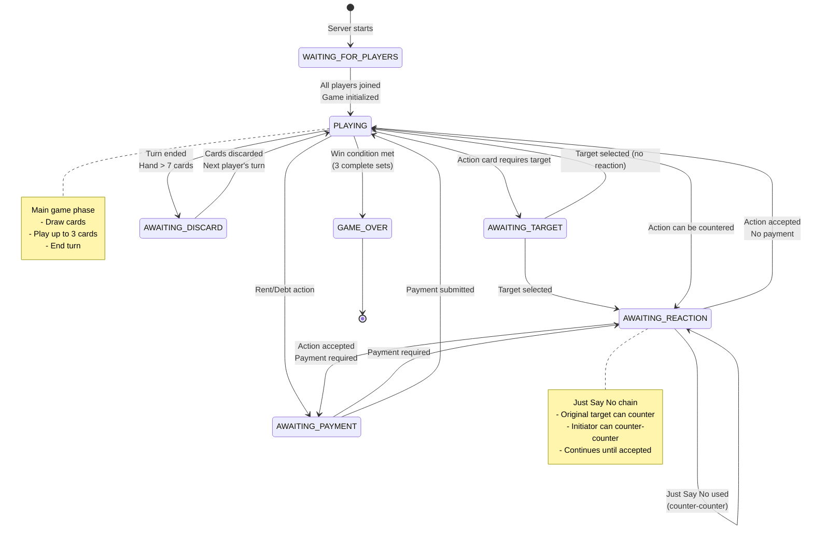

### Turn Lifecycle

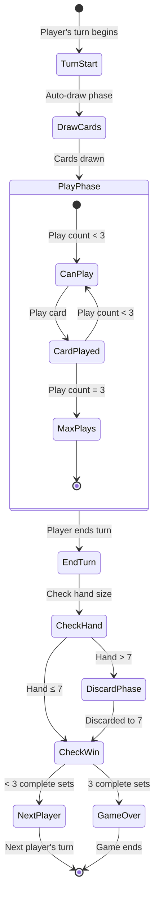

---

## Network Protocol

### Socket.IO Events

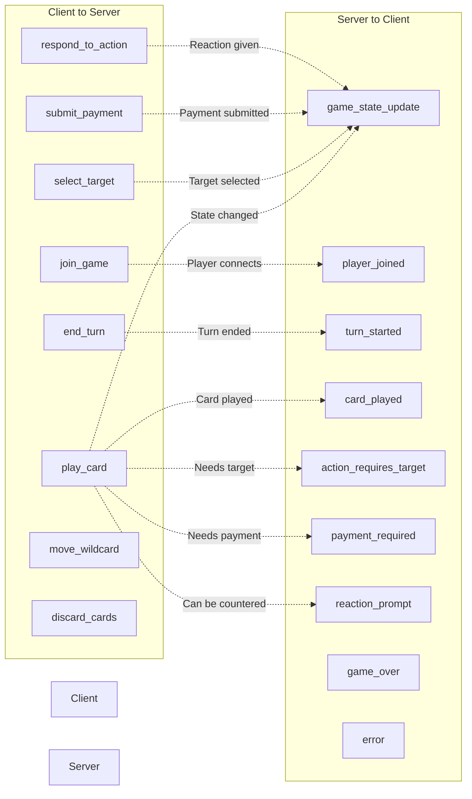

### Event Payload Structure

```typescript
// Client → Server Events
interface PlayCardPayload {
  cardId: string;
  placement?: {
    area: 'bank' | 'properties';
    color?: PropertyColor;
    targetPlayerId?: string;
  };
}

interface SelectTargetPayload {
  targetPlayerId: string;
  propertyId?: string;  // For Force Deal
}

interface SubmitPaymentPayload {
  cardIds: string[];
}

interface RespondToActionPayload {
  accept: boolean;  // false = use Just Say No
  justSayNoCardId?: string;
}

// Server → Client Events
interface GameStateUpdatePayload {
  gameState: SanitizedGameState;
  myHand: Card[];  // Only for requesting player
}

interface ActionRequiresTargetPayload {
  actionType: ActionType;
  validTargets: string[];  // Player IDs
  requiresProperty?: boolean;  // For Force Deal
}

interface PaymentRequiredPayload {
  amount: number;
  fromPlayerId: string;
  toPlayerId: string;
  reason: string;
}

interface ReactionPromptPayload {
  actionType: ActionType;
  initiatorId: string;
  canCounter: boolean;  // Has Just Say No in hand
}
```

---

## Class Hierarchy

### Card Class Hierarchy

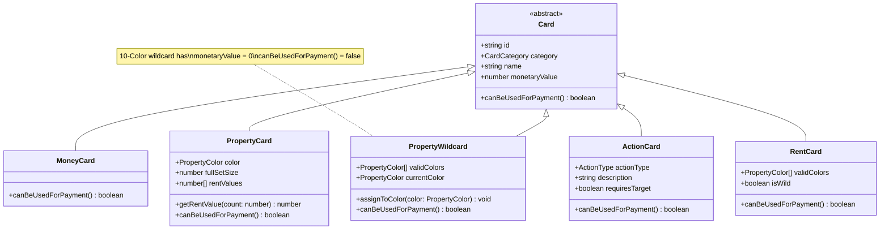

### Game State Classes

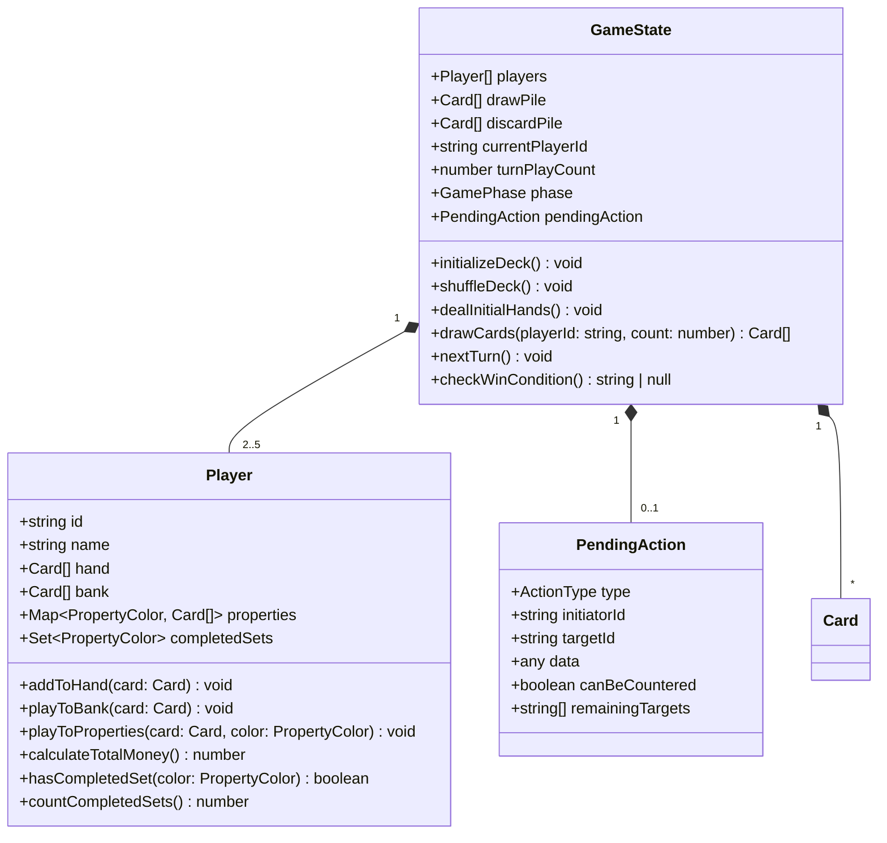

### Action Handler Hierarchy

```mermaid
classDiagram
    class ActionHandler {
        <<abstract>>
        #GameState gameState
        +canExecute(playerId: string, params: any) boolean
        +requiresTarget() boolean
        +execute(playerId: string, params: any) void
        #getPlayer(playerId: string) Player
        #getOpponents(playerId: string) Player[]
    }
    
    class RentHandler {
        +canExecute(playerId: string, params: any) boolean
        +requiresTarget() boolean
        +execute(playerId: string, params: any) void
        -calculateRentAmount(player: Player, color: PropertyColor) number
    }
    
    class SlyDealHandler {
        +canExecute(playerId: string, params: any) boolean
        +requiresTarget() boolean
        +execute(playerId: string, params: any) void
    }
    
    class ForceDealHandler {
        +canExecute(playerId: string, params: any) boolean
        +requiresTarget() boolean
        +execute(playerId: string, params: any) void
    }
    
    class DealBreakerHandler {
        +canExecute(playerId: string, params: any) boolean
        +requiresTarget() boolean
        +execute(playerId: string, params: any) void
    }
    
    class PaymentHandler {
        +processPayment(fromId: string, toId: string, amount: number, cardIds: string[]) void
        -routeCardToRecipient(card: Card, recipient: Player) void
    }
    
    class ReactionHandler {
        +promptReaction(actionType: ActionType, initiatorId: string, targetId: string) void
        +handleReaction(accept: boolean, justSayNoCardId?: string) void
        -resolveAction() void
    }
    
    ActionHandler <|-- RentHandler
    ActionHandler <|-- SlyDealHandler
    ActionHandler <|-- ForceDealHandler
    ActionHandler <|-- DealBreakerHandler
    ActionHandler <|-- PaymentHandler
    ActionHandler <|-- ReactionHandler
```

---

## Key Design Patterns

### 1. Authoritative Server Pattern
- **Server**: Single source of truth for game state
- **Client**: Thin UI layer that displays server state
- **Validation**: All game logic validated server-side
- **Security**: Opponent hands hidden via state sanitization

### 2. Event-Driven Architecture
- **Socket.IO**: Bidirectional event communication
- **Decoupling**: Components communicate via events
- **Real-time**: Instant state synchronization across clients

### 3. Strategy Pattern (Action Handlers)
- **Base Class**: `ActionHandler` defines interface
- **Concrete Handlers**: Each action type has dedicated handler
- **Polymorphism**: GameEngine routes to appropriate handler

### 4. State Machine Pattern
- **Phases**: Explicit game phases (PLAYING, AWAITING_TARGET, etc.)
- **Transitions**: Controlled state transitions
- **Validation**: Actions validated against current phase

### 5. Observer Pattern (React Context)
- **Context**: Global game state observable
- **Components**: Subscribe to state changes
- **Updates**: Automatic re-rendering on state changes

---

## Performance Considerations

### Server Optimizations
1. **State Sanitization**: Only send necessary data to each client
2. **Event Batching**: Group related state updates
3. **Memory Management**: Proper cleanup of disconnected players
4. **Card Pooling**: Reuse card objects from discard pile

### Client Optimizations
1. **React Memoization**: Prevent unnecessary re-renders
2. **Lazy Loading**: Load modals only when needed
3. **Virtual Scrolling**: For large card collections (future)
4. **Debouncing**: Prevent rapid-fire actions

### Network Optimizations
1. **Compression**: Socket.IO compression enabled
2. **Delta Updates**: Send only changed state (future enhancement)
3. **Reconnection**: Automatic reconnection with exponential backoff
4. **Heartbeat**: Keep-alive to detect disconnections

---

## Security Considerations

### Server-Side Validation
- All actions validated before execution
- Player identity verified via socket ID
- Turn ownership checked before allowing plays
- Card ownership verified before moves

### State Sanitization
- Opponent hands completely hidden
- Draw pile sequence hidden
- Only top discard card visible
- Pending actions sanitized per player perspective

### Network Security
- CORS configured for development/production
- Socket.IO authentication (future enhancement)
- Rate limiting on actions (future enhancement)
- Input validation on all payloads

---

## Scalability Considerations

### Current Architecture (Single Server)
- Supports 2-5 players per game
- Single game instance per server
- Suitable for LAN play

### Future Enhancements
- **Multiple Games**: Support multiple concurrent games
- **Game Rooms**: Room-based game management
- **Persistence**: Save/load game state
- **Spectator Mode**: Watch games without playing
- **Replay System**: Record and replay games

---

*Made with Bob*