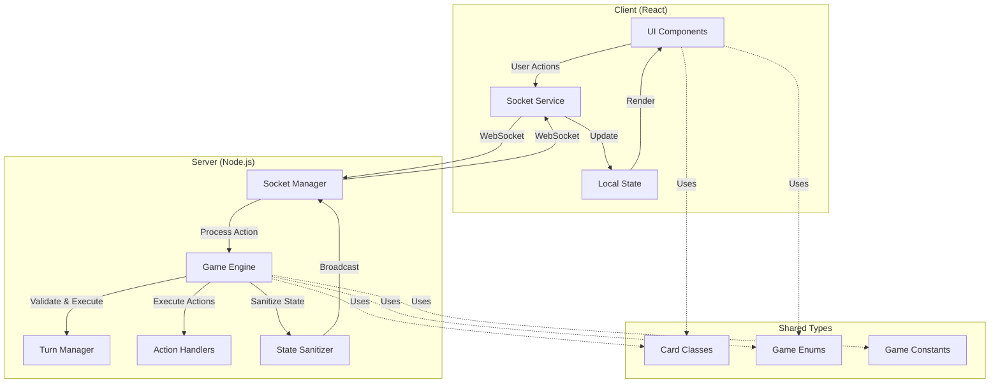

# Monopoly Deal - Detailed Implementation Plan

## Project Configuration
- **Architecture**: Monorepo with React frontend, Node.js/TypeScript backend
- **Approach**: Phased implementation following documented specifications
- **Communication**: Socket.IO for real-time bidirectional events
- **Pattern**: Authoritative server with thin clients

---

## Project Structure

```
monopoly-deal/
├── shared/
│   ├── types.ts              # OOP contracts (Card, Player, GameState)
│   ├── constants.ts          # Game constants (colors, card limits, etc.)
│   └── enums.ts              # GameState, CardCategory, PropertyColor enums
├── server/
│   ├── src/
│   │   ├── index.ts          # Server entry point
│   │   ├── game/
│   │   │   ├── GameEngine.ts # Core game loop & state machine
│   │   │   ├── CardFactory.ts # Card instantiation from CSV
│   │   │   ├── TurnManager.ts # Turn sequence enforcement
│   │   │   └── WinCondition.ts # Victory detection
│   │   ├── actions/
│   │   │   ├── ActionHandler.ts # Base action processor
│   │   │   ├── RentHandler.ts   # Rent card logic
│   │   │   ├── StealHandler.ts  # Sly Deal, Force Deal, Deal Breaker
│   │   │   ├── PaymentHandler.ts # Debt collection & resolution
│   │   │   └── ReactionHandler.ts # Just Say No interrupt system
│   │   ├── network/
│   │   │   ├── SocketManager.ts # Socket.IO connection handling
│   │   │   ├── EventEmitter.ts  # Server → Client broadcasts
│   │   │   └── StateSanitizer.ts # Hide opponent hands/draw pile
│   │   └── utils/
│   │       ├── csvParser.ts     # Parse carddata.csv (rows 1-106)
│   │       └── validator.ts     # Move validation logic
│   ├── package.json
│   └── tsconfig.json
├── client/
│   ├── src/
│   │   ├── App.tsx           # Root React component
│   │   ├── components/
│   │   │   ├── GameBoard.tsx    # Main game layout
│   │   │   ├── PlayerHand.tsx   # Local player's cards
│   │   │   ├── PropertyArea.tsx # Property display (grouped by color)
│   │   │   ├── BankArea.tsx     # Money pile display
│   │   │   ├── OpponentView.tsx # Other players' tableaus
│   │   │   ├── CenterPiles.tsx  # Draw/discard pile indicators
│   │   │   └── modals/
│   │   │       ├── TargetModal.tsx    # Select target player/property
│   │   │       ├── PaymentModal.tsx   # Choose payment cards
│   │   │       ├── ReactionModal.tsx  # Just Say No prompt
│   │   │       └── DualUseModal.tsx   # Action vs Bank choice
│   │   ├── hooks/
│   │   │   ├── useSocket.ts     # Socket.IO connection hook
│   │   │   ├── useGameState.ts  # Local state management
│   │   │   └── useDragDrop.ts   # Card drag-and-drop logic
│   │   ├── services/
│   │   │   └── socketService.ts # Socket event handlers
│   │   └── styles/
│   │       └── game.css         # Game UI styling
│   ├── public/
│   │   └── index.html
│   ├── package.json
│   └── tsconfig.json
├── package.json              # Root workspace config
└── README.md
```

---

## Phase 1: Core Architecture & Data Contracts

### Objective
Establish TypeScript OOP foundation consumed by both server and client.

### Tasks

#### 1.1 Setup Monorepo Structure
- Initialize root `package.json` with workspaces
- Create `shared/`, `server/`, `client/` directories
- Configure TypeScript for each workspace with path aliases

#### 1.2 Define Shared Enums (`shared/enums.ts`)
```typescript
enum GamePhase {
  WAITING_FOR_PLAYERS,
  PLAYING,
  AWAITING_TARGET,
  AWAITING_PAYMENT,
  AWAITING_REACTION,
  GAME_OVER
}

enum CardCategory {
  MONEY,
  PROPERTY,
  PROPERTY_WILDCARD,
  ACTION,
  RENT
}

enum PropertyColor {
  BROWN,
  LIGHT_BLUE,
  PURPLE,
  ORANGE,
  RED,
  YELLOW,
  GREEN,
  DARK_BLUE,
  RAILROAD,
  UTILITY,
  WILD_10_COLOR
}

enum ActionType {
  DEAL_BREAKER,
  JUST_SAY_NO,
  SLY_DEAL,
  FORCE_DEAL,
  DEBT_COLLECTOR,
  ITS_MY_BIRTHDAY,
  PASS_GO,
  HOUSE,
  HOTEL,
  DOUBLE_THE_RENT
}
```

#### 1.3 Define Base Card Class (`shared/types.ts`)
```typescript
abstract class Card {
  id: string;
  category: CardCategory;
  name: string;
  monetaryValue: number;
  
  constructor(id: string, category: CardCategory, name: string, value: number) {
    this.id = id;
    this.category = category;
    this.name = name;
    this.monetaryValue = value;
  }
  
  abstract canBeUsedForPayment(): boolean;
}
```

#### 1.4 Define Card Subclasses
- **MoneyCard**: Pure currency, always goes to bank
- **PropertyCard**: Has color, fullSetSize, rentValues array
- **PropertyWildcard**: Dual-color or 10-color, currentColor property
- **ActionCard**: Has actionType, function description, targeting requirements
- **RentCard**: Has validColors array, isWild flag

#### 1.5 Define Player Class
```typescript
class Player {
  id: string;
  name: string;
  hand: Card[];
  bank: Card[];
  properties: Map<PropertyColor, Card[]>; // Grouped by color
  completedSets: PropertyColor[];
  
  // Methods
  addToHand(card: Card): void;
  playToBank(card: Card): void;
  playToProperties(card: Card, color: PropertyColor): void;
  calculateTotalMoney(): number;
  hasCompletedSet(color: PropertyColor): boolean;
  countCompletedSets(): number;
}
```

#### 1.6 Define GameState Class
```typescript
class GameState {
  players: Player[];
  drawPile: Card[];
  discardPile: Card[];
  currentPlayerIndex: number;
  phase: GamePhase;
  turnPlayCount: number; // Track 3-card limit
  pendingAction: PendingAction | null; // For interrupts
  winner: Player | null;
  
  // Methods
  initializeDeck(cards: Card[]): void;
  shuffleDeck(): void;
  dealInitialHands(): void;
  drawCards(player: Player, count: number): void;
  nextTurn(): void;
  checkWinCondition(): Player | null;
  sanitizeForPlayer(playerId: string): SanitizedGameState;
}
```

#### 1.7 Define Constants (`shared/constants.ts`)
```typescript
export const GAME_CONSTANTS = {
  MIN_PLAYERS: 2,
  MAX_PLAYERS: 5,
  INITIAL_HAND_SIZE: 5,
  NORMAL_DRAW_COUNT: 2,
  EMPTY_HAND_DRAW_COUNT: 5,
  MAX_HAND_SIZE: 7,
  MAX_PLAYS_PER_TURN: 3,
  WINNING_SET_COUNT: 3,
  
  PROPERTY_SET_SIZES: {
    BROWN: 2,
    LIGHT_BLUE: 3,
    PURPLE: 3,
    ORANGE: 3,
    RED: 3,
    YELLOW: 3,
    GREEN: 3,
    DARK_BLUE: 2,
    RAILROAD: 4,
    UTILITY: 2
  },
  
  RENT_VALUES: {
    BROWN: [1, 2],
    LIGHT_BLUE: [1, 2, 3],
    // ... (from carddata.csv)
  }
};
```

### Deliverables
- ✅ `shared/types.ts` with all OOP blueprints
- ✅ `shared/enums.ts` with game state enums
- ✅ `shared/constants.ts` with game rules
- ✅ TypeScript compilation successful for shared module

---

## Phase 2: Data Pipeline & Server Initialization

### Objective
Parse 106 cards from CSV and instantiate correct TypeScript objects.

### Tasks

#### 2.1 CSV Parser (`server/src/utils/csvParser.ts`)
- Read `carddata.csv` from root directory
- **CRITICAL**: Stop parsing at row 106 (not 996 or beyond)
- Parse columns: #, Category, Name, Value, Full set number, Rent Value, Function, Constraint
- Handle monetary value extraction (e.g., "$5M" → 5)
- Return array of raw card data objects

#### 2.2 Card Factory (`server/src/game/CardFactory.ts`)
```typescript
class CardFactory {
  static createCard(rawData: RawCardData): Card {
    switch(rawData.category) {
      case 'Money':
        return new MoneyCard(id, value);
      case 'Property':
        return new PropertyCard(id, name, value, color, fullSetSize, rentValues);
      case 'Property Wildcard':
        if (name.includes('10-Color')) {
          return new Wild10ColorCard(id, 0); // NO monetary value
        }
        return new DualColorWildcard(id, name, value, color1, color2);
      case 'Action':
        return new ActionCard(id, name, value, actionType, function);
      case 'Rent':
        return new RentCard(id, name, value, validColors, isWild);
    }
  }
  
  static createDeck(): Card[] {
    const rawCards = CSVParser.parse('carddata.csv');
    return rawCards.map(raw => this.createCard(raw));
  }
}
```

#### 2.3 Server Initialization (`server/src/index.ts`)
- Initialize Express server
- Setup Socket.IO with CORS for LAN access
- Create GameEngine instance
- Load deck via CardFactory
- Setup connection event handlers

#### 2.4 Game Engine Bootstrap (`server/src/game/GameEngine.ts`)
```typescript
class GameEngine {
  private gameState: GameState;
  
  constructor() {
    this.gameState = new GameState();
  }
  
  initializeGame(playerNames: string[]): void {
    // Create Player instances
    // Load and shuffle deck
    // Deal 5 cards to each player
    // Set first player
    this.gameState.phase = GamePhase.PLAYING;
  }
  
  processAction(playerId: string, action: PlayerAction): ActionResult {
    // Validate action
    // Update state
    // Return result
  }
}
```

### Deliverables
- ✅ CSV parser that stops at row 106
- ✅ CardFactory instantiating all 106 cards correctly
- ✅ Server starts and initializes deck
- ✅ Deck shuffle and initial deal logic working

---

## Phase 3: Core Game Loop (Server-Side Engine)

### Objective
Build authoritative state machine without networking.

### Tasks

#### 3.1 Turn Manager (`server/src/game/TurnManager.ts`)
```typescript
class TurnManager {
  startTurn(gameState: GameState): void {
    const player = gameState.getCurrentPlayer();
    const drawCount = player.hand.length === 0 ? 5 : 2;
    gameState.drawCards(player, drawCount);
    gameState.turnPlayCount = 0;
  }
  
  endTurn(gameState: GameState): void {
    const player = gameState.getCurrentPlayer();
    // Enforce 7-card hand limit
    if (player.hand.length > 7) {
      gameState.phase = GamePhase.AWAITING_DISCARD;
      return;
    }
    gameState.nextTurn();
  }
  
  canPlayCard(gameState: GameState): boolean {
    return gameState.turnPlayCount < 3;
  }
}
```

#### 3.2 Card Placement Logic (`server/src/game/GameEngine.ts`)
```typescript
playCard(playerId: string, cardId: string, placement: Placement): void {
  const card = this.findCard(playerId, cardId);
  
  if (card.category === CardCategory.MONEY) {
    this.routeToBank(playerId, card);
  } else if (card.category === CardCategory.PROPERTY) {
    this.routeToProperties(playerId, card, placement.color);
  } else if (card.category === CardCategory.ACTION) {
    if (card.monetaryValue > 0 && placement.useAsBank) {
      this.routeToBank(playerId, card); // Loses action ability
    } else {
      this.executeAction(playerId, card, placement.targets);
      this.routeToDiscard(card);
    }
  } else if (card.category === CardCategory.RENT) {
    this.executeRent(playerId, card, placement);
    this.routeToDiscard(card);
  }
  
  this.gameState.turnPlayCount++;
}
```

#### 3.3 Property Management
- Implement property grouping by color
- Wildcard color assignment logic
- Wildcard movement validation (only during active turn)
- Completed set detection

#### 3.4 Win Condition (`server/src/game/WinCondition.ts`)
```typescript
class WinCondition {
  check(gameState: GameState): Player | null {
    for (const player of gameState.players) {
      const uniqueCompletedSets = this.countUniqueCompletedSets(player);
      if (uniqueCompletedSets >= 3) {
        return player;
      }
    }
    return null;
  }
  
  private countUniqueCompletedSets(player: Player): number {
    const completedColors = new Set<PropertyColor>();
    
    for (const [color, cards] of player.properties) {
      const setSize = GAME_CONSTANTS.PROPERTY_SET_SIZES[color];
      const propertyCount = cards.filter(c => 
        c.category === CardCategory.PROPERTY || 
        c.category === CardCategory.PROPERTY_WILDCARD
      ).length;
      
      if (propertyCount >= setSize) {
        completedColors.add(color);
      }
    }
    
    return completedColors.size;
  }
}
```

#### 3.5 Draw Pile Management
- Implement draw pile depletion detection
- Shuffle discard pile into new draw pile when empty
- Handle edge case: both piles empty (game continues with no draws)

### Deliverables
- ✅ Turn sequence enforcement (draw, play, discard)
- ✅ Card routing to correct areas (bank/properties/discard)
- ✅ 3-card play limit enforcement
- ✅ 7-card hand limit enforcement
- ✅ Win condition detection
- ✅ Property set completion logic

---

## Phase 4: Networking & Real-Time Sync

### Objective
Wrap game engine in Socket.IO communication layer.

### Tasks

#### 4.1 Socket Manager (`server/src/network/SocketManager.ts`)
```typescript
class SocketManager {
  private io: Server;
  private gameEngine: GameEngine;
  private playerSockets: Map<string, Socket>;
  
  constructor(io: Server, gameEngine: GameEngine) {
    this.io = io;
    this.gameEngine = gameEngine;
    this.setupEventHandlers();
  }
  
  private setupEventHandlers(): void {
    this.io.on('connection', (socket) => {
      socket.on('join_game', (playerName) => this.handleJoin(socket, playerName));
      socket.on('play_card', (data) => this.handlePlayCard(socket, data));
      socket.on('end_turn', () => this.handleEndTurn(socket));
      socket.on('select_target', (data) => this.handleTargetSelection(socket, data));
      socket.on('select_payment', (data) => this.handlePayment(socket, data));
      socket.on('react_to_action', (data) => this.handleReaction(socket, data));
      socket.on('move_wildcard', (data) => this.handleWildcardMove(socket, data));
      socket.on('discard_cards', (data) => this.handleDiscard(socket, data));
    });
  }
  
  broadcastGameState(): void {
    for (const [playerId, socket] of this.playerSockets) {
      const sanitizedState = this.gameEngine.getSanitizedState(playerId);
      socket.emit('game_state_update', sanitizedState);
    }
  }
}
```

#### 4.2 State Sanitizer (`server/src/network/StateSanitizer.ts`)
```typescript
class StateSanitizer {
  static sanitizeForPlayer(gameState: GameState, playerId: string): SanitizedGameState {
    return {
      players: gameState.players.map(p => ({
        id: p.id,
        name: p.name,
        hand: p.id === playerId ? p.hand : [], // Hide opponent hands
        handCount: p.hand.length, // Show count only
        bank: p.bank, // Bank is visible
        properties: p.properties, // Properties are visible
        completedSets: p.completedSets
      })),
      drawPileCount: gameState.drawPile.length, // Hide sequence
      discardPile: gameState.discardPile.slice(-1), // Show top card only
      currentPlayerIndex: gameState.currentPlayerIndex,
      phase: gameState.phase,
      turnPlayCount: gameState.turnPlayCount,
      pendingAction: gameState.pendingAction,
      winner: gameState.winner
    };
  }
}
```

#### 4.3 Event Definitions
**Server → Client Events:**
- `game_state_update`: Full sanitized state
- `player_joined`: New player notification
- `turn_started`: Turn begin notification
- `card_played`: Card play animation trigger
- `action_requires_target`: Prompt target selection
- `payment_required`: Prompt payment selection
- `reaction_prompt`: Just Say No opportunity
- `game_over`: Winner announcement

**Client → Server Events:**
- `join_game`: Player connection
- `play_card`: Card play request
- `end_turn`: Turn end request
- `select_target`: Target selection response
- `select_payment`: Payment selection response
- `react_to_action`: Just Say No response
- `move_wildcard`: Wildcard repositioning
- `discard_cards`: Excess card discard

#### 4.4 Connection Management
- Handle player disconnection/reconnection
- Maintain game state during temporary disconnects
- Implement timeout for inactive players
- LAN IP address discovery for clients

### Deliverables
- ✅ Socket.IO server setup with event handlers
- ✅ State sanitization per player perspective
- ✅ Real-time state broadcasting
- ✅ Client connection/disconnection handling
- ✅ Event payload validation

---

## Phase 5: Action Card Logic & Interrupt Mechanics

### Objective
Implement complex multi-step action cards and interrupt system.

### Tasks

#### 5.1 Base Action Handler (`server/src/actions/ActionHandler.ts`)
```typescript
abstract class ActionHandler {
  abstract canExecute(gameState: GameState, playerId: string, card: ActionCard): boolean;
  abstract requiresTarget(): boolean;
  abstract execute(gameState: GameState, playerId: string, card: ActionCard, targets?: any): void;
}
```

#### 5.2 Rent Handler (`server/src/actions/RentHandler.ts`)
```typescript
class RentHandler extends ActionHandler {
  canExecute(gameState: GameState, playerId: string, card: RentCard): boolean {
    const player = gameState.getPlayer(playerId);
    // Verify player has matching property on table
    for (const color of card.validColors) {
      if (player.properties.has(color) && player.properties.get(color).length > 0) {
        return true;
      }
    }
    return false;
  }
  
  execute(gameState: GameState, playerId: string, card: RentCard, data: RentData): void {
    const player = gameState.getPlayer(playerId);
    const propertyCount = player.properties.get(data.selectedColor).length;
    const isComplete = player.hasCompletedSet(data.selectedColor);
    const baseRent = this.calculateRent(data.selectedColor, propertyCount, isComplete);
    
    let totalRent = baseRent;
    if (data.doubleTheRent) {
      totalRent *= 2;
      gameState.turnPlayCount++; // Double counts as separate play
    }
    
    const targets = card.isWild ? [data.targetPlayer] : gameState.getOpponents(playerId);
    
    for (const targetId of targets) {
      gameState.phase = GamePhase.AWAITING_REACTION;
      gameState.pendingAction = {
        type: 'RENT',
        initiator: playerId,
        target: targetId,
        amount: totalRent,
        canBeNegated: true
      };
      // Emit reaction_prompt to target
    }
  }
}
```

#### 5.3 Steal Handlers
**Sly Deal:**
- Validate target property is NOT part of completed set
- Transfer property to initiator's property area
- Maintain color grouping

**Force Deal:**
- Validate NEITHER property is part of completed set
- Swap properties between players
- Maintain color grouping

**Deal Breaker:**
- Validate target has completed set
- Transfer entire set (including House/Hotel if present)
- Update completed sets tracking

#### 5.4 Payment Handler (`server/src/actions/PaymentHandler.ts`)
```typescript
class PaymentHandler {
  requestPayment(gameState: GameState, payerId: string, amount: number): void {
    gameState.phase = GamePhase.AWAITING_PAYMENT;
    gameState.pendingAction = {
      type: 'PAYMENT',
      target: payerId,
      amount: amount,
      selectedCards: []
    };
    // Emit payment_required to payer
  }
  
  processPayment(gameState: GameState, payerId: string, cardIds: string[]): void {
    const payer = gameState.getPlayer(payerId);
    const recipient = gameState.getPlayer(gameState.pendingAction.initiator);
    
    let totalValue = 0;
    for (const cardId of cardIds) {
      const card = payer.findCard(cardId);
      
      // 10-Color Wildcard has NO value
      if (card instanceof Wild10ColorCard) {
        throw new Error('Cannot pay with 10-Color Wildcard');
      }
      
      totalValue += card.monetaryValue;
      
      // Route payment
      if (card.category === CardCategory.MONEY || card.category === CardCategory.ACTION) {
        recipient.bank.push(card);
      } else if (card.category === CardCategory.PROPERTY || card.category === CardCategory.PROPERTY_WILDCARD) {
        recipient.properties.get(card.currentColor).push(card);
      }
      
      payer.removeCard(cardId);
    }
    
    // No change given for overpayment
    gameState.phase = GamePhase.PLAYING;
    gameState.pendingAction = null;
  }
}
```

#### 5.5 Reaction Handler (`server/src/actions/ReactionHandler.ts`)
```typescript
class ReactionHandler {
  promptReaction(gameState: GameState, targetId: string): void {
    const target = gameState.getPlayer(targetId);
    const hasJustSayNo = target.hand.some(c => 
      c instanceof ActionCard && c.actionType === ActionType.JUST_SAY_NO
    );
    
    gameState.phase = GamePhase.AWAITING_REACTION;
    // Emit reaction_prompt with hasJustSayNo flag
  }
  
  handleReaction(gameState: GameState, targetId: string, useJustSayNo: boolean): void {
    if (!useJustSayNo) {
      // Execute original action
      this.resolveAction(gameState);
      return;
    }
    
    // Negate action, flip to counter-counter
    const originalInitiator = gameState.pendingAction.initiator;
    gameState.pendingAction.target = originalInitiator;
    gameState.pendingAction.initiator = targetId;
    
    // Prompt original player for counter-counter
    this.promptReaction(gameState, originalInitiator);
  }
  
  private resolveAction(gameState: GameState): void {
    const action = gameState.pendingAction;
    
    switch(action.type) {
      case 'RENT':
        this.paymentHandler.requestPayment(gameState, action.target, action.amount);
        break;
      case 'STEAL':
        this.stealHandler.executeSteal(gameState, action);
        break;
      // ... other action types
    }
    
    gameState.pendingAction = null;
  }
}
```

#### 5.6 Special Action Cards
**Pass Go:**
- Draw 2 additional cards (doesn't count toward turn draw)
- No targeting required

**It's My Birthday:**
- Target ALL opponents
- Each pays $2M
- Chain reaction prompts

**Debt Collector:**
- Target ONE opponent
- Opponent pays $5M
- Single reaction prompt

**House/Hotel:**
- Validate completed set exists
- Validate no Railroad/Utility
- Validate House before Hotel
- Validate max 1 House + 1 Hotel per set
- Attach to property set (not individual card)

### Deliverables
- ✅ All 10 action card types implemented
- ✅ Rent calculation with House/Hotel bonuses
- ✅ Just Say No interrupt chain working
- ✅ Payment selection and transfer logic
- ✅ Target validation for all actions
- ✅ Double the Rent chaining

---

## Phase 6: Client UI & Rendering

### Objective
Build React-based player interface with drag-and-drop.

### Tasks

#### 6.1 Socket Service (`client/src/services/socketService.ts`)
```typescript
class SocketService {
  private socket: Socket;
  
  connect(serverUrl: string): void {
    this.socket = io(serverUrl);
    this.setupListeners();
  }
  
  private setupListeners(): void {
    this.socket.on('game_state_update', (state) => {
      // Update React state
    });
    
    this.socket.on('action_requires_target', (data) => {
      // Show target modal
    });
    
    this.socket.on('payment_required', (data) => {
      // Show payment modal
    });
    
    this.socket.on('reaction_prompt', (data) => {
      // Show Just Say No modal
    });
  }
  
  playCard(cardId: string, placement: Placement): void {
    this.socket.emit('play_card', { cardId, placement });
  }
  
  selectTarget(targetData: any): void {
    this.socket.emit('select_target', targetData);
  }
}
```

#### 6.2 Game Board Layout (`client/src/components/GameBoard.tsx`)
```tsx
const GameBoard: React.FC = () => {
  return (
    <div className="game-board">
      <div className="opponents-area">
        {opponents.map(opp => <OpponentView key={opp.id} player={opp} />)}
      </div>
      
      <div className="center-area">
        <CenterPiles drawCount={drawPileCount} discardTop={discardTop} />
        <TurnIndicator currentPlayer={currentPlayer} />
      </div>
      
      <div className="local-player-area">
        <div className="tableau">
          <BankArea cards={localPlayer.bank} />
          <PropertyArea properties={localPlayer.properties} />
        </div>
        <PlayerHand cards={localPlayer.hand} onCardPlay={handleCardPlay} />
      </div>
      
      {showTargetModal && <TargetModal {...targetModalProps} />}
      {showPaymentModal && <PaymentModal {...paymentModalProps} />}
      {showReactionModal && <ReactionModal {...reactionModalProps} />}
    </div>
  );
};
```

#### 6.3 Drag-and-Drop System (`client/src/hooks/useDragDrop.ts`)
```typescript
const useDragDrop = () => {
  const handleDragStart = (e: DragEvent, card: Card) => {
    e.dataTransfer.setData('cardId', card.id);
  };
  
  const handleDrop = (e: DragEvent, dropZone: DropZone) => {
    const cardId = e.dataTransfer.getData('cardId');
    const card = findCard(cardId);
    
    if (dropZone === 'table') {
      if (card.category === CardCategory.MONEY) {
        socketService.playCard(cardId, { area: 'bank' });
      } else if (card.category === CardCategory.PROPERTY) {
        socketService.playCard(cardId, { area: 'properties', color: card.color });
      } else if (card.category === CardCategory.ACTION && card.monetaryValue > 0) {
        // Show dual-use modal
        setShowDualUseModal(true);
      } else {
        // Action/Rent card - may require targeting
        handleActionCard(card);
      }
    }
  };
  
  return { handleDragStart, handleDrop };
};
```

#### 6.4 Modal Components

**Target Modal:**
- Display valid targets based on action type
- For Sly Deal: Show opponent → Show their properties (filter completed sets)
- For Force Deal: Show own properties → Show opponent properties
- For Rent (10-color): Show opponent list
- Emit selection to server

**Payment Modal:**
- Display amount owed
- Show player's bank and properties
- Allow multi-select to reach amount
- Show running total
- Disable 10-Color Wildcard selection
- Emit selection to server

**Reaction Modal:**
- Display action being played against player
- Show "Just Say No" button (disabled if not in hand)
- Show "Let it be" button
- Auto-close on timeout (optional)
- Emit response to server

**Dual-Use Modal:**
- Display action card with monetary value
- "Play as Action" button
- "Bank as Cash" button
- Emit choice to server

#### 6.5 Property Area Rendering
```tsx
const PropertyArea: React.FC<{ properties: Map<PropertyColor, Card[]> }> = ({ properties }) => {
  return (
    <div className="property-area">
      {Array.from(properties.entries()).map(([color, cards]) => (
        <PropertySet key={color} color={color} cards={cards}>
          {cards.map(card => (
            <PropertyCard 
              key={card.id} 
              card={card}
              draggable={isActivePlayer && card.category === CardCategory.PROPERTY_WILDCARD}
              onDrag={handleWildcardDrag}
            />
          ))}
          {hasCompletedSet(color, cards) && (
            <SetCompleteIndicator />
          )}
          {getHouseHotel(color, cards) && (
            <UpgradeIndicator upgrades={getHouseHotel(color, cards)} />
          )}
        </PropertySet>
      ))}
    </div>
  );
};
```

#### 6.6 Visual Feedback
- Card play animations
- Turn indicator highlighting
- Completed set visual distinction
- Drag preview
- Invalid drop zone feedback
- Loading states during server processing
- Toast notifications for game events

#### 6.7 Responsive Design
- Support 1920x1080 desktop resolution
- Scale UI for different screen sizes
- Mobile-friendly layout (optional stretch goal)

### Deliverables
- ✅ React app with Socket.IO integration
- ✅ Drag-and-drop card play system
- ✅ All modal components functional
- ✅ Property area with color grouping
- ✅ Opponent view with hidden hands
- ✅ Real-time state updates
- ✅ Visual feedback for all actions

---

## Phase 7: Testing & Edge Case Validation

### Objective
Ensure game rules are correctly enforced.

### Test Cases

#### 7.1 Turn Sequence Tests
- ✅ Player with 0 cards draws 5 (not 2)
- ✅ Normal draw is 2 cards
- ✅ 3-card play limit enforced
- ✅ Wildcard color change doesn't count toward limit
- ✅ Double the Rent counts as separate play
- ✅ 7-card hand limit enforced at turn end
- ✅ Discard prompt appears when >7 cards

#### 7.2 Card Routing Tests
- ✅ Money cards go to bank
- ✅ Property cards go to properties (grouped by color)
- ✅ Action cards with value prompt dual-use modal
- ✅ Action cards banked lose action ability
- ✅ Action/Rent cards go to discard after use

#### 7.3 Property Management Tests
- ✅ Wildcards can be moved during active turn
- ✅ Wildcards cannot be moved during opponent turn
- ✅ Wildcard movement can break completed set
- ✅ Completed set detection accurate
- ✅ 10-Color Wildcard has NO monetary value

#### 7.4 Action Card Tests
- ✅ Sly Deal cannot steal from completed set
- ✅ Force Deal validates neither property is complete
- ✅ Deal Breaker only steals complete sets
- ✅ Rent card validates player has matching property
- ✅ House/Hotel only on completed sets
- ✅ House/Hotel not on Railroad/Utility
- ✅ Max 1 House + 1 Hotel per set
- ✅ Hotel requires House first

#### 7.5 Payment Tests
- ✅ No change given for overpayment
- ✅ Properties used as payment go to opponent's properties
- ✅ Money used as payment goes to opponent's bank
- ✅ 10-Color Wildcard cannot be used for payment
- ✅ Payment modal shows correct total

#### 7.6 Interrupt Tests
- ✅ Just Say No negates action
- ✅ Counter-counter chain works
- ✅ Just Say No doesn't count toward play limit
- ✅ Reaction timeout handling
- ✅ Multiple targets handled sequentially

#### 7.7 Win Condition Tests
- ✅ 3 completed sets of different colors wins
- ✅ Same color sets don't count as multiple
- ✅ Game ends immediately on win
- ✅ Winner announcement broadcast

#### 7.8 Edge Cases
- ✅ Draw pile empty → shuffle discard
- ✅ Both piles empty → no draws available
- ✅ Player disconnection handling
- ✅ Simultaneous action attempts
- ✅ Invalid move rejection

### Deliverables
- ✅ Unit tests for game logic
- ✅ Integration tests for Socket.IO events
- ✅ Manual test playthrough (2-5 players)
- ✅ Edge case validation
- ✅ Bug fixes for discovered issues

---

## Phase 8: Documentation & Deployment Setup

### Objective
Prepare project for deployment and future maintenance.

### Tasks

#### 8.1 Code Documentation
- Add JSDoc comments to all classes/methods
- Document complex algorithms (rent calculation, set detection)
- Create architecture diagram (Mermaid)
- Document state machine transitions

#### 8.2 User Documentation
- Create `SETUP.md` with installation instructions
- Document LAN connection process
- Create quick start guide
- Add troubleshooting section

#### 8.3 Deployment Configuration
- Create Docker configuration (optional)
- Setup environment variables
- Configure production build scripts
- Add health check endpoints

#### 8.4 Development Tools
- Setup ESLint/Prettier
- Add pre-commit hooks
- Configure VS Code workspace settings
- Add debug configurations

### Deliverables
- ✅ Comprehensive code documentation
- ✅ User setup guide
- ✅ Deployment instructions
- ✅ Development environment setup

---

## Critical Implementation Notes

### 1. CSV Parsing Constraint
**MUST stop at row 106** - The dataset contains exactly 106 playable cards. Do not parse beyond this row.

### 2. 10-Color Wildcard Special Case
- Has `monetaryValue: 0` in the Card object
- Cannot be used for debt payment
- Can be moved freely during active turn
- Must be played with another property to charge rent

### 3. Just Say No Chain
- Creates nested interrupt loops
- Original player gets counter-counter opportunity
- Does NOT count toward 3-card play limit
- Can be played against another Just Say No

### 4. Payment Flow
- No change mechanism exists
- Overpayment value is forfeited
- Properties transfer to opponent's property section (not bank)
- Money transfers to opponent's bank

### 5. Wildcard Mobility
- Can be moved even if it breaks completed set
- No locking mechanism
- Only during active player's turn
- Dual-color wildcards can flip between colors

### 6. House/Hotel Restrictions
- Only on completed sets
- No Railroads or Utilities
- House must exist before Hotel
- Max 1 House + 1 Hotel per set
- Adds to rent value calculation

### 7. Rent Card Validation
- Backend MUST verify player has matching property BEFORE allowing play
- Prevents invalid rent charges
- Dual-color rent cards require color selection

### 8. State Sanitization
- Opponent hands must be hidden (show count only)
- Draw pile sequence must be hidden (show count only)
- Discard pile shows top card only
- Bank and properties are always visible

---

## Architecture Diagram



---

## Technology Stack Summary

### Backend
- **Runtime**: Node.js 18+
- **Language**: TypeScript 5+
- **Framework**: Express.js
- **WebSocket**: Socket.IO 4+
- **CSV Parsing**: csv-parser or papaparse
- **Testing**: Jest

### Frontend
- **Framework**: React 18+
- **Language**: TypeScript 5+
- **Build Tool**: Vite
- **WebSocket**: Socket.IO Client
- **Styling**: CSS Modules or Styled Components
- **Drag-and-Drop**: react-dnd or native HTML5

### Shared
- **Language**: TypeScript 5+
- **Module System**: ES Modules

### Development
- **Package Manager**: npm or yarn
- **Linting**: ESLint
- **Formatting**: Prettier
- **Version Control**: Git

---

## Estimated Timeline

- **Phase 1**: 2-3 days (Core architecture)
- **Phase 2**: 1-2 days (Data pipeline)
- **Phase 3**: 3-4 days (Game loop)
- **Phase 4**: 2-3 days (Networking)
- **Phase 5**: 4-5 days (Action cards)
- **Phase 6**: 5-6 days (Client UI)
- **Phase 7**: 2-3 days (Testing)
- **Phase 8**: 1-2 days (Documentation)

**Total**: 20-28 days for full implementation

---

## Next Steps

1. Review and approve this implementation plan
2. Setup monorepo structure with TypeScript configuration
3. Begin Phase 1: Core Architecture & Data Contracts
4. Implement phases sequentially with testing at each stage
5. Conduct full playthrough testing before final deployment
