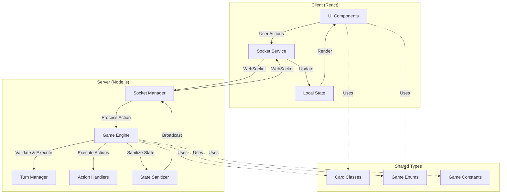

**User:**

<task>
I want to build the monopoly deal game, follow the "instruction.md" for instructions, and see the card detail in "carddata.csv", create a detailed plan to implement this game
</task>
<environment_details>
# VSCode Visible Files


# VSCode Open Tabs


# Current Time
Current time in ISO 8601 UTC format: 2026-05-02T14:14:52.271Z
User time zone: America/Toronto, UTC-4:00

# Current Cost
$0.00

# Review Exclusions
The following file patterns are excluded from code reviews:
- .vscode/**

# Current Mode
<slug>plan</slug>
<name>📝 Plan</name>


# Current Workspace Directory (/Users/zyx/Library/CloudStorage/OneDrive-个人/IBMBOB/Code/Challlenge) Files
.DS_Store
AGENTS.md
carddata.csv
Instruction.md
Participant social tile -IBM Bob Dev Day Hackathon-May26.png
README.md
.bob/
You have not created a todo list yet. Create one with `update_todo_list` if your task is complicated or involves multiple steps.
</environment_details>

---

**Assistant:**

I'll analyze the project requirements and create a detailed implementation plan for the Monopoly Deal game. Let me start by gathering information about the existing files.

<read_file>
<args>
  <file>
    <path>Instruction.md</path>
  </file>
  <file>
    <path>carddata.csv</path>
    <line_range>1-50</line_range>
  </file>
  <file>
    <path>AGENTS.md</path>
  </file>
  <file>
    <path>README.md</path>
  </file>
</args>
</read_file>

---

**User:**

[read_file for 4 files] Result:
<files>
<file><path>Instruction.md</path>
<content lines="1-121">
  1 | # Project Plan: Monopoly Deal (LAN Multiplayer Edition)
  2 | 
  3 | ## System Role
  4 | You are an expert game developer and software architect. We are building a networked, digital version of the card game "Monopoly Deal" designed for high-leverage, AI-assisted development. You will write clean, modular, well-documented code. We will build this iteratively, following the strict phased approach below.
  5 | 
  6 | ## Project Overview
  7 | A multiplayer (2-5 players) turn-based digital card game replicating Monopoly Deal. The game operates on a local network (LAN) client-server model to enforce strict hidden-information rules. It requires a robust state management system, real-time bi-directional communication, and an interrupt-driven event loop.
  8 | 
  9 | ## I. Technical Stack & Architecture
 10 | * **Architecture Pattern:** Authoritative Server with Thin Clients.
 11 | * **Backend Server:** Node.js with TypeScript and Socket.IO. Manages the central `GameState`, validates all moves, and handles real-time broadcasting.
 12 | * **Frontend Client:** Lightweight Web UI (HTML/CSS/TypeScript or React). Connects via WebSockets to the host's local IP. Requires zero installation for players across different OS ecosystems.
 13 | * **Shared Contracts:** A dedicated `shared/types.ts` folder containing the object-oriented blueprints (`Card`, `Player`, `GameState`). Both server and client consume these exact same types to prevent data desync.
 14 | 
 15 | ## II. Game Rules & Mechanics
 16 | 
 17 | ### 1. Game Objective
 18 | The first player to complete 3 full property sets of different colors on the table in front of them wins the game.
 19 | 
 20 | ### 2. Game Setup
 21 | * **Deck Size:** 106 playable cards (Data parsed from provided dataset).
 22 | * **Players:** 2 to 5 players.
 23 | * **Initial Deal:** The deck is shuffled, and 5 cards are dealt to each player.
 24 | * **Draw Pile:** Remaining cards are placed face down in the center.
 25 | 
 26 | ### 3. Turn Sequence
 27 | * **Start of Turn:** Active player draws 2 cards. *Edge Case:* If a player starts with 0 cards in hand, they draw 5 cards instead.
 28 | * **Play Phase:** The player may play up to 3 cards (0, 1, 2, or 3). Changing the color of a wild property is NOT counted into the 3-play limit.
 29 | * **End of Turn:** Maximum hand size is 7. Excess cards must be discarded into the center discard pile.
 30 | 
 31 | ### 4. Play Areas
 32 | * **The Bank:** Money cards or Action cards (used purely as money) placed face up. Action cards banked lose their action ability permanently.
 33 | * **The Property Section:** Property cards and Wildcards organized by color.
 34 | * **The Discard Pile:** Action cards placed here when played for their effect.
 35 | 
 36 | ### 5. Strict Constraints
 37 | * **No Take-Backs:** Once a card is placed, it cannot be returned to the hand.
 38 | * **Rearranging:** Players may rearrange properties/wildcards limitlessly, but *only* during their turn.
 39 | * **Look, Don't Touch (Enforced by Networking):** Clients only receive sanitized state updates. They cannot see opponents' hands or the draw pile sequence.
 40 | * **Empty Draw Pile:** If depleted, the discard pile is shuffled to form a new draw pile.
 41 | 
 42 | ---
 43 | 
 44 | ## III. Phased Implementation Plan
 45 | 
 46 | ### Phase 1: Core Architecture & Data Contracts (COMPLETED)
 47 | The object-oriented structure has been defined in TypeScript. The `shared/types.ts` file contains the base `Card` class, its subclasses (`MoneyCard`, `PropertyCard`, `Wildcard`, `ActionCard`, `RentCard`), the `Player` state manager, and the central `GameState` environment.
 48 | 
 49 | ### Phase 2: Data Pipeline & Server Initialization
 50 | * **Objective:** Ingest the raw 106-card dataset and initialize the server environment.
 51 | * **Tasks:**
 52 |   * Write a utility script on the Node.js backend to parse the card dataset.
 53 |   * Instantiate the correct TypeScript `Card` subclasses based on category and attributes.
 54 |   * Implement `GameState.initialize_deck()`, `shuffle_deck()`, and the initial 5-card distribution logic.
 55 | 
 56 | ### Phase 3: The Core Game Loop (Server-Side Engine)
 57 | * **Objective:** Build the authoritative state machine without networking attached.
 58 | * **Tasks:**
 59 |   * Implement the `step(action)` method to process generic player actions.
 60 |   * Enforce turn constraints: Drawing 2 (or 5) cards, the 3-play limit, and the 7-card discard limit.
 61 |   * Implement the placement logic: routing cards to the Bank, Property lists, or Discard pile.
 62 |   * Implement the Win Condition listener (checking for 3 completed sets).
 63 | 
 64 | ### Phase 4: Networking & Real-Time Sync
 65 | * **Objective:** Wrap the core engine in a Socket.IO communication layer.
 66 | * **Tasks:**
 67 |   * Establish the WebSocket connection protocol.
 68 |   * Define event payloads (e.g., `SERVER_STATE_BROADCAST`, `CLIENT_ACTION_REQUEST`).
 69 |   * Implement state sanitization: Ensure the server strips private hand data before broadcasting the `GameState` to individual clients.
 70 | 
 71 | ### Phase 5: Action Card Logic & Interrupt Mechanics
 72 | * **Objective:** Implement the complex, multi-step constraints of specific game cards.
 73 | * **Tasks:**
 74 |   * **Targeting:** Implement an asynchronous pause state for cards requiring inputs (e.g., Sly Deal target selection).
 75 |   * **Payment Resolution:** Implement debt logic where targets must select cards from their Bank/Properties to satisfy a monetary value. Overpayment yields no change.
 76 |   * **The "Just Say No" Protocol:** Create the interrupt broadcast loop. When an action targets a player, the server must transition to an `AWAITING_REACTION` phase, polling the victim for a counter-play before executing the original action. Realize it like this: when a player is targeted by any action/rent card, a window will jump with title "Do you want to play Just Say No?", and two buttons: "I say NO!" and "Let it be". If this player does not have "Just Say No", they cannot click the "I say NO!" button.
 77 | 
 78 | ### Phase 6: Client UI & Rendering
 79 | * **Objective:** Build the local player interface.
 80 | * **Tasks:**
 81 |   * Create a clean, responsive layout dividing the screen into: Opponent Tableaus, Center Piles, Local Tableaus, and Local Hand.
 82 |   * Implement visual drag-and-drop or click-to-play mechanics that emit Socket.IO events to the server.
 83 |   * Create modal prompts for targeting, paying rent, and reacting to interrupts.
 84 | 
 85 | #### Details & Edge Cases:
 86 | 
 87 | **1. Drag and Drop Processing (`on_card_drop`)**
 88 | When the user drags a card from their hand to the "Table Area", the backend must evaluate the card's Category and route it automatically:
 89 | * **Money Cards:** Automatically route to the `Player.bank`.
 90 | * **Property Cards:** Automatically route to `Player.properties` (grouping by color).
 91 | * **Dual-Use Cards (Action/Rent):** Pause execution and trigger a UI Prompt to the user: "Play as Action or Bank as Cash?"
 92 | 
 93 | **2. The Targeting System**
 94 | If a player plays a targeted Action or Rent card (e.g., Sly Deal, Force Deal, Debt Collector, Rent card, Deal Breaker), the game loop must pause and enter an `AWAITING_TARGET` state. The UI must prompt the user to select valid targets based on the card's `get_required_targets()` method.
 95 | * **Sly Deal:** User clicks a target opponent -> User clicks a valid property from that opponent's table -> Backend verifies it is not part of a completed set -> Execution continues.
 96 | * **Force Deal:** User clicks their own property -> User clicks opponent's property -> Backend verifies neither is a complete set -> Execution continues.
 97 | * **Rent Cards:** * *Validation:* The backend must first verify that the active player has at least one property on the table that matches the rent card's `valid_colors`.
 98 |   * *Targeting:* If standard, targets all opponents. If `is_wild` (10-color), user must click/select specific target opponent.
 99 | * **Double the Rent Flow:** When a user selects a Rent Card, the UI must prompt: *"Would you like to chain Double the Rent?"*. Playing a Rent card + Double the Rent counts as **two** plays toward the 3-card turn limit.
100 | * **Payment Flow:** Backend calculates total rent owed. Game enters `AWAITING_PAYMENT`. Targeted opponent(s) receive pop-up showing amount. Opponent clicks preferred payment combination (Bank/Properties). Backend processes transfer (no change given).
101 | 
102 | **3. House & Hotel Constraints**
103 | The backend must strictly enforce the following property upgrades:
104 | * A House can *only* be placed on a completed property set.
105 | * A Hotel can *only* be placed on a property set that already has a House.
106 | * At most 1 House and 1 Hotel can be put on one complete property set.
107 | * Houses and Hotels cannot be placed on Railroads or Utility sets.
108 | 
109 | **4. The Reaction/Interrupt System (Just Say No)**
110 | The game must handle asynchronous interrupts. Whenever Player A plays an action negatively affecting Player B, the game state changes to `AWAITING_REACTION`.
111 | * UI sends prompt to Player B (as defined in Phase 5).
112 | * If declined/unavailable, original action resolves.
113 | * If accepted, original action is negated.
114 | * *Crucial Edge Case:* If Player B plays "Just Say No", state flips back to Player A to ask: "Player B played Just Say No. Do you want to play a Just Say No to counter?".
115 | 
116 | **5. Wild Property Manipulation (`handle_wildcard_swap`)**
117 | The game must allow players to adjust their wildcards on the table limitlessly during their active turn.
118 | * **Active Turn Constraint:** Backend must reject wildcard manipulation requests if it is not the user's active turn.
119 | * **Dual-Color Wildcards:** UI features a "Swap Color" button. Backend automatically reorganizes `Player.properties`.
120 | * **10-Color Wildcards:** UI allows drag and drop to attach it to different existing property sets.
121 | * **Official Wildcard Rule:** Wildcards (including the 10-color wildcard) can be moved around the table as much as the player wants during their turn, even if it breaks up a previously completed set. No locking occurs.
</content>
</file>
<file><path>carddata.csv</path>
<content lines="1-50">
 1 | #,Category,Name of Card,Value,Full set number,Rent Value,Function,Constraint and Notices,
 2 | 1,Action,Deal Breaker,$5M,,,Steal a complete property set from any player (have to be a full set).,Takes attached a complete set (have to be a full set).,Discarded to center pile after use.
 3 | 2,Action,Deal Breaker,$5M,,,Steal a complete property set from any player (have to be a full set).,Takes attached a complete set (have to be a full set).,Discarded to center pile after use.
 4 | 3,Action,Just Say No,$4M,,,Cancel any Action card played against you.,Does NOT count as a card turn. Can be played against another Just Say No.,Discarded to center pile after use.
 5 | 4,Action,Just Say No,$4M,,,Cancel any Action card played against you.,Does NOT count as a card turn. Can be played against another Just Say No.,Discarded to center pile after use.
 6 | 5,Action,Just Say No,$4M,,,Cancel any Action card played against you.,Does NOT count as a card turn. Can be played against another Just Say No.,Discarded to center pile after use.
 7 | 6,Action,Sly Deal,$3M,,,Steal a single property from any player (cannot be part of a full set).,Cannot steal a property that is part of a completed set.,Discarded to center pile after use.
 8 | 7,Action,Sly Deal,$3M,,,Steal a single property from any player (cannot be part of a full set).,Cannot steal a property that is part of a completed set.,Discarded to center pile after use.
 9 | 8,Action,Sly Deal,$3M,,,Steal a single property from any player (cannot be part of a full set).,Cannot steal a property that is part of a completed set.,Discarded to center pile after use.
10 | 9,Action,Force Deal,$3M,,,Swap a single property with another player (neither can be from a full set).,Neither property swapped can be part of a completed set.,Discarded to center pile after use.
11 | 10,Action,Force Deal,$3M,,,Swap a single property with another player (neither can be from a full set).,Neither property swapped can be part of a completed set.,Discarded to center pile after use.
12 | 11,Action,Force Deal,$3M,,,Swap a single property with another player (neither can be from a full set).,Neither property swapped can be part of a completed set.,Discarded to center pile after use.
13 | 12,Action,Debt Collector,$3M,,,Force one specific player to pay you $5M.,Opponent cannot pay with a 10-Color Wildcard (it has no monetary value).,Discarded to center pile after use.
14 | 13,Action,Debt Collector,$3M,,,Force one specific player to pay you $5M.,Opponent cannot pay with a 10-Color Wildcard (it has no monetary value).,Discarded to center pile after use.
15 | 14,Action,Debt Collector,$3M,,,Force one specific player to pay you $5M.,Opponent cannot pay with a 10-Color Wildcard (it has no monetary value).,Discarded to center pile after use.
16 | 15,Action,It's My Birthday,$2M,,,Force all players to pay you $2M.,Opponents cannot pay with a 10-Color Wildcard (it has no monetary value).,Discarded to center pile after use.
17 | 16,Action,It's My Birthday,$2M,,,Force all players to pay you $2M.,Opponents cannot pay with a 10-Color Wildcard (it has no monetary value).,Discarded to center pile after use.
18 | 17,Action,It's My Birthday,$2M,,,Force all players to pay you $2M.,Opponents cannot pay with a 10-Color Wildcard (it has no monetary value).,Discarded to center pile after use.
19 | 18,Action,Pass Go,$1M,,,Draw 2 extra cards from the deck.,,Discarded to center pile after use.
20 | 19,Action,Pass Go,$1M,,,Draw 2 extra cards from the deck.,,Discarded to center pile after use.
21 | 20,Action,Pass Go,$1M,,,Draw 2 extra cards from the deck.,,Discarded to center pile after use.
22 | 21,Action,Pass Go,$1M,,,Draw 2 extra cards from the deck.,,Discarded to center pile after use.
23 | 22,Action,Pass Go,$1M,,,Draw 2 extra cards from the deck.,,Discarded to center pile after use.
24 | 23,Action,Pass Go,$1M,,,Draw 2 extra cards from the deck.,,Discarded to center pile after use.
25 | 24,Action,Pass Go,$1M,,,Draw 2 extra cards from the deck.,,Discarded to center pile after use.
26 | 25,Action,Pass Go,$1M,,,Draw 2 extra cards from the deck.,,Discarded to center pile after use.
27 | 26,Action,Pass Go,$1M,,,Draw 2 extra cards from the deck.,,Discarded to center pile after use.
28 | 27,Action,Pass Go,$1M,,,Draw 2 extra cards from the deck.,,Discarded to center pile after use.
29 | 28,Action,House,$3M,,,Add $3M to the rent value of a full property set.,Must be laid on a completed set. Cannot be added to Railroad or Utility sets. Cannot put on the full property set that already have a house.,Discarded to center pile after use.
30 | 29,Action,House,$3M,,,Add $3M to the rent value of a full property set.,Must be laid on a completed set. Cannot be added to Railroad or Utility sets. Cannot put on the full property set that already have a house.,Discarded to center pile after use.
31 | 30,Action,House,$3M,,,Add $3M to the rent value of a full property set.,Must be laid on a completed set. Cannot be added to Railroad or Utility sets. Cannot put on the full property set that already have a house.,Discarded to center pile after use.
32 | 31,Action,Hotel,$4M,,,Add $4M to the rent value of a full set (must already have a House).,Must be laid on a completed set that already has a House. No Railroads/Utilities. Cannot put on the full property set that already have a hotel.,Discarded to center pile after use.
33 | 32,Action,Hotel,$4M,,,Add $4M to the rent value of a full set (must already have a House).,Must be laid on a completed set that already has a House. No Railroads/Utilities. Cannot put on the full property set that already have a hotel.,Discarded to center pile after use.
34 | 33,Action,Double The Rent,$1M,,,Play with a Rent card to double the total rent owed.,Counts as a card play. Negated by a Just Say No. You can play 2 in one turn.,Discarded to center pile after use.
35 | 34,Action,Double The Rent,$1M,,,Play with a Rent card to double the total rent owed.,Counts as a card play. Negated by a Just Say No. You can play 2 in one turn.,Discarded to center pile after use.
36 | 35,Property,Brown,$1M,2,"1,2",Collect 2 to complete the Brown set.,"If used as payment, goes to opponent's property section. Excess cards form a new set.",Put in the property area of that player
37 | 36,Property,Brown,$1M,,,Collect 2 to complete the Brown set.,"If used as payment, goes to opponent's property section. Excess cards form a new set.",Put in the property area of that player
38 | 37,Property,Light Blue,$1M,3,"1,2,3",Collect 3 to complete the Light Blue set.,"If used as payment, goes to opponent's property section. Excess cards form a new set.",Put in the property area of that player
39 | 38,Property,Light Blue,$1M,,,Collect 3 to complete the Light Blue set.,"If used as payment, goes to opponent's property section. Excess cards form a new set.",Put in the property area of that player
40 | 39,Property,Light Blue,$1M,,,Collect 3 to complete the Light Blue set.,"If used as payment, goes to opponent's property section. Excess cards form a new set.",Put in the property area of that player
41 | 40,Property,Purple,$2M,3,"1,2,4",Collect 3 to complete the Purple set.,"If used as payment, goes to opponent's property section. Excess cards form a new set.",Put in the property area of that player
42 | 41,Property,Purple,$2M,,,Collect 3 to complete the Purple set.,"If used as payment, goes to opponent's property section. Excess cards form a new set.",Put in the property area of that player
43 | 42,Property,Purple,$2M,,,Collect 3 to complete the Purple set.,"If used as payment, goes to opponent's property section. Excess cards form a new set.",Put in the property area of that player
44 | 43,Property,Orange,$2M,3,"1,3,5",Collect 3 to complete the Orange set.,"If used as payment, goes to opponent's property section. Excess cards form a new set.",Put in the property area of that player
45 | 44,Property,Orange,$2M,,,Collect 3 to complete the Orange set.,"If used as payment, goes to opponent's property section. Excess cards form a new set.",Put in the property area of that player
46 | 45,Property,Orange,$2M,,,Collect 3 to complete the Orange set.,"If used as payment, goes to opponent's property section. Excess cards form a new set.",Put in the property area of that player
47 | 46,Property,Red,$3M,3,"2,3,6",Collect 3 to complete the Red set.,"If used as payment, goes to opponent's property section. Excess cards form a new set.",Put in the property area of that player
48 | 47,Property,Red,$3M,,,Collect 3 to complete the Red set.,"If used as payment, goes to opponent's property section. Excess cards form a new set.",Put in the property area of that player
49 | 48,Property,Red,$3M,,,Collect 3 to complete the Red set.,"If used as payment, goes to opponent's property section. Excess cards form a new set.",Put in the property area of that player
50 | 49,Property,Yellow,$3M,3,"2,4,6",Collect 3 to complete the Yellow set.,"If used as payment, goes to opponent's property section. Excess cards form a new set.",Put in the property area of that player
</content>
</file>
<file><path>AGENTS.md</path>
<content lines="1-39">
 1 | # AGENTS.md
 2 | 
 3 | This file provides guidance to agents when working with code in this repository.
 4 | 
 5 | ## Project Overview
 6 | Monopoly Deal LAN multiplayer card game - Node.js/TypeScript backend with Socket.IO, lightweight web client.
 7 | 
 8 | ## Architecture
 9 | - **Authoritative Server Pattern**: Server manages central GameState, validates all moves, broadcasts updates
10 | - **Shared Contracts**: `shared/types.ts` contains OOP blueprints (Card, Player, GameState) consumed by both server and client
11 | - **Hidden Information Enforcement**: Clients receive sanitized state updates only (no opponent hands or draw pile visibility)
12 | 
13 | ## Critical Game Rules (Non-Obvious)
14 | - **10-Color Wildcard**: Has NO monetary value (cannot be used for debt payment) despite being a property card
15 | - **Wildcard Mobility**: Wildcards can be moved freely during active turn, even if it breaks a completed set (no locking)
16 | - **Just Say No Chain**: When countered, original player gets chance to counter-counter (creates async interrupt loop)
17 | - **House/Hotel Restrictions**: Only on completed sets, no Railroads/Utilities, max 1 House + 1 Hotel per set
18 | - **Rent Card Validation**: Backend must verify player has matching property BEFORE allowing rent card play
19 | - **Double the Rent**: Counts as separate play toward 3-card limit (Rent + Double = 2 plays)
20 | - **Payment Flow**: No change given for overpayment; properties used as payment transfer to opponent's property section
21 | - **Empty Hand Edge Case**: Player starting turn with 0 cards draws 5 instead of 2
22 | 
23 | ## Data Structure
24 | - 106 cards defined in `carddata.csv` with categories: Action, Property, Property Wildcard, Rent, Money
25 | - Card routing: Money → Bank, Property → Properties (grouped by color), Action/Rent → Discard after use
26 | - Dual-use cards (Action with monetary value) require UI prompt: "Play as Action or Bank as Cash?"
27 | 
28 | ## State Machine
29 | - Game states: PLAYING, AWAITING_TARGET, AWAITING_PAYMENT, AWAITING_REACTION
30 | - Turn constraints: Draw 2 (or 5), play up to 3 cards, discard to 7 max hand size
31 | - Win condition: First player with 3 complete property sets of different colors
32 | 
33 | ## Implementation Phases
34 | Phase 1 (COMPLETED): Core architecture & data contracts in TypeScript
35 | Phase 2: Data pipeline & server initialization
36 | Phase 3: Core game loop (server-side engine)
37 | Phase 4: Networking & real-time sync
38 | Phase 5: Action card logic & interrupt mechanics
39 | Phase 6: Client UI & rendering
</content>
</file>
<file><path>README.md</path>
<content lines="1-1">
1 | # Challlenge
</content>
</file>
</files>
<environment_details>
# VSCode Visible Files


# VSCode Open Tabs


# Current Time
Current time in ISO 8601 UTC format: 2026-05-02T14:15:03.234Z
User time zone: America/Toronto, UTC-4:00

# Current Cost
$0.03

# Review Exclusions
The following file patterns are excluded from code reviews:
- .vscode/**

# Current Mode
<slug>plan</slug>
<name>📝 Plan</name>
You have not created a todo list yet. Create one with `update_todo_list` if your task is complicated or involves multiple steps.
</environment_details>

---

**Assistant:**

I need to see more of the card data to understand the complete dataset structure.

<read_file>
<args>
  <file>
    <path>carddata.csv</path>
    <line_range>51-106</line_range>
  </file>
</args>
</read_file>

---

**User:**

[read_file for 'carddata.csv'. Reading multiple files at once is more efficient for the LLM. If other files are relevant to your current task, please read them simultaneously.] Result:
<files>
<file><path>carddata.csv</path>
<content lines="51-106">
 51 | 50,Property,Yellow,$3M,,,Collect 3 to complete the Yellow set.,"If used as payment, goes to opponent's property section. Excess cards form a new set.",Put in the property area of that player
 52 | 51,Property,Yellow,$3M,,,Collect 3 to complete the Yellow set.,"If used as payment, goes to opponent's property section. Excess cards form a new set.",Put in the property area of that player
 53 | 52,Property,Green,$4M,3,"2,4,7",Collect 3 to complete the Green set.,"If used as payment, goes to opponent's property section. Excess cards form a new set.",Put in the property area of that player
 54 | 53,Property,Green,$4M,,,Collect 3 to complete the Green set.,"If used as payment, goes to opponent's property section. Excess cards form a new set.",Put in the property area of that player
 55 | 54,Property,Green,$4M,,,Collect 3 to complete the Green set.,"If used as payment, goes to opponent's property section. Excess cards form a new set.",Put in the property area of that player
 56 | 55,Property,Dark Blue,$4M,2,"3,8",Collect 2 to complete the Dark Blue set.,"If used as payment, goes to opponent's property section. Excess cards form a new set.",Put in the property area of that player
 57 | 56,Property,Dark Blue,$4M,,,Collect 2 to complete the Dark Blue set.,"If used as payment, goes to opponent's property section. Excess cards form a new set.",Put in the property area of that player
 58 | 57,Property,Railroad,$2M,4,"1,2,3,4",Collect 4 to complete the Railroad set.,Cannot have House/Hotel cards added to it.,Put in the property area of that player
 59 | 58,Property,Railroad,$2M,,,Collect 4 to complete the Railroad set.,Cannot have House/Hotel cards added to it.,Put in the property area of that player
 60 | 59,Property,Railroad,$2M,,,Collect 4 to complete the Railroad set.,Cannot have House/Hotel cards added to it.,Put in the property area of that player
 61 | 60,Property,Railroad,$2M,,,Collect 4 to complete the Railroad set.,Cannot have House/Hotel cards added to it.,Put in the property area of that player
 62 | 61,Property,Utility,$2M,2,"1,2",Collect 2 to complete the Utility set.,Cannot have House/Hotel cards added to it.,Put in the property area of that player
 63 | 62,Property,Utility,$2M,,,Collect 2 to complete the Utility set.,Cannot have House/Hotel cards added to it.,Put in the property area of that player
 64 | 63,Property Wildcard,Purple & Orange,$2M,,,Use as either a Purple or Orange property.,Can be flipped/moved during your turn. Excess cards must create a new set.,Put in the property area of that player
 65 | 64,Property Wildcard,Purple & Orange,$2M,,,Use as either a Purple or Orange property.,Can be flipped/moved during your turn. Excess cards must create a new set.,Put in the property area of that player
 66 | 65,Property Wildcard,Light Blue & Brown,$1M,,,Use as either a Light Blue or Brown property.,Can be flipped/moved during your turn. Excess cards must create a new set.,Put in the property area of that player
 67 | 66,Property Wildcard,Light Blue & Railroad,$4M,,,Use as either a Light Blue or Railroad property.,Can be flipped/moved during your turn. Excess cards must create a new set.,Put in the property area of that player
 68 | 67,Property Wildcard,Dark Blue & Green,$4M,,,Use as either a Dark Blue or Green property.,Can be flipped/moved during your turn. Excess cards must create a new set.,Put in the property area of that player
 69 | 68,Property Wildcard,Railroad & Green,$4M,,,Use as either a Railroad or Green property.,Can be flipped/moved during your turn. Excess cards must create a new set.,Put in the property area of that player
 70 | 69,Property Wildcard,Red & Yellow,$3M,,,Use as either a Red or Yellow property.,Can be flipped/moved during your turn. Excess cards must create a new set.,Put in the property area of that player
 71 | 70,Property Wildcard,Red & Yellow,$3M,,,Use as either a Red or Yellow property.,Can be flipped/moved during your turn. Excess cards must create a new set.,Put in the property area of that player
 72 | 71,Property Wildcard,Utility & Railroad,$2M,,,Use as either a Utility or Railroad property.,Can be flipped/moved during your turn. Excess cards must create a new set.,Put in the property area of that player
 73 | 72,Property Wildcard,10-Color Multi-Color,0,,,Can be used as any property color in the game.,Cannot pay debts with this (no value). Must be played with another property to charge rent.,Put in the property area of that player
 74 | 73,Property Wildcard,10-Color Multi-Color,0,,,Can be used as any property color in the game.,Cannot pay debts with this (no value). Must be played with another property to charge rent.,Put in the property area of that player
 75 | 74,Rent,Purple & Orange,$1M,,,Charge rent to all players for your Purple or Orange properties.,Charges ALL players. Can only pick one color to charge. Must have that property on table.,Discarded to center pile after use.
 76 | 75,Rent,Purple & Orange,$1M,,,Charge rent to all players for your Purple or Orange properties.,Charges ALL players. Can only pick one color to charge. Must have that property on table.,Discarded to center pile after use.
 77 | 76,Rent,Railroad & Utility,$1M,,,Charge rent to all players for your Railroad or Utility properties.,Charges ALL players. Can only pick one color to charge. Must have that property on table.,Discarded to center pile after use.
 78 | 77,Rent,Railroad & Utility,$1M,,,Charge rent to all players for your Railroad or Utility properties.,Charges ALL players. Can only pick one color to charge. Must have that property on table.,Discarded to center pile after use.
 79 | 78,Rent,Green & Dark Blue,$1M,,,Charge rent to all players for your Green or Dark Blue properties.,Charges ALL players. Can only pick one color to charge. Must have that property on table.,Discarded to center pile after use.
 80 | 79,Rent,Green & Dark Blue,$1M,,,Charge rent to all players for your Green or Dark Blue properties.,Charges ALL players. Can only pick one color to charge. Must have that property on table.,Discarded to center pile after use.
 81 | 80,Rent,Brown & Light Blue,$1M,,,Charge rent to all players for your Brown or Light Blue properties.,Charges ALL players. Can only pick one color to charge. Must have that property on table.,Discarded to center pile after use.
 82 | 81,Rent,Brown & Light Blue,$1M,,,Charge rent to all players for your Brown or Light Blue properties.,Charges ALL players. Can only pick one color to charge. Must have that property on table.,Discarded to center pile after use.
 83 | 82,Rent,Red & Yellow,$1M,,,Charge rent to all players for your Red or Yellow properties.,Charges ALL players. Can only pick one color to charge. Must have that property on table.,Discarded to center pile after use.
 84 | 83,Rent,Red & Yellow,$1M,,,Charge rent to all players for your Red or Yellow properties.,Charges ALL players. Can only pick one color to charge. Must have that property on table.,Discarded to center pile after use.
 85 | 84,Rent,10-Color Wild Rent,$3M,,,Charge rent to one specific player for any property color you own.,Charges ONE specific player. Must have the chosen property on the table.,Discarded to center pile after use.
 86 | 85,Rent,10-Color Wild Rent,$3M,,,Charge rent to one specific player for any property color you own.,Charges ONE specific player. Must have the chosen property on the table.,Discarded to center pile after use.
 87 | 86,Rent,10-Color Wild Rent,$3M,,,Charge rent to one specific player for any property color you own.,Charges ONE specific player. Must have the chosen property on the table.,Discarded to center pile after use.
 88 | 87,Money,$10M,$10M,,,Bank in your money pile to pay off future debts.,Cannot pay from your hand. No change is given if you overpay a debt.,
 89 | 88,Money,$5M,$5M,,,Bank in your money pile to pay off future debts.,Cannot pay from your hand. No change is given if you overpay a debt.,
 90 | 89,Money,$5M,$5M,,,Bank in your money pile to pay off future debts.,Cannot pay from your hand. No change is given if you overpay a debt.,
 91 | 90,Money,$4M,$4M,,,Bank in your money pile to pay off future debts.,Cannot pay from your hand. No change is given if you overpay a debt.,
 92 | 91,Money,$4M,$4M,,,Bank in your money pile to pay off future debts.,Cannot pay from your hand. No change is given if you overpay a debt.,
 93 | 92,Money,$4M,$4M,,,Bank in your money pile to pay off future debts.,Cannot pay from your hand. No change is given if you overpay a debt.,
 94 | 93,Money,$3M,$3M,,,Bank in your money pile to pay off future debts.,Cannot pay from your hand. No change is given if you overpay a debt.,
 95 | 94,Money,$3M,$3M,,,Bank in your money pile to pay off future debts.,Cannot pay from your hand. No change is given if you overpay a debt.,
 96 | 95,Money,$3M,$3M,,,Bank in your money pile to pay off future debts.,Cannot pay from your hand. No change is given if you overpay a debt.,
 97 | 96,Money,$2M,$2M,,,Bank in your money pile to pay off future debts.,Cannot pay from your hand. No change is given if you overpay a debt.,
 98 | 97,Money,$2M,$2M,,,Bank in your money pile to pay off future debts.,Cannot pay from your hand. No change is given if you overpay a debt.,
 99 | 98,Money,$2M,$2M,,,Bank in your money pile to pay off future debts.,Cannot pay from your hand. No change is given if you overpay a debt.,
100 | 99,Money,$2M,$2M,,,Bank in your money pile to pay off future debts.,Cannot pay from your hand. No change is given if you overpay a debt.,
101 | 100,Money,$2M,$2M,,,Bank in your money pile to pay off future debts.,Cannot pay from your hand. No change is given if you overpay a debt.,
102 | 101,Money,$1M,$1M,,,Bank in your money pile to pay off future debts.,Cannot pay from your hand. No change is given if you overpay a debt.,
103 | 102,Money,$1M,$1M,,,Bank in your money pile to pay off future debts.,Cannot pay from your hand. No change is given if you overpay a debt.,
104 | 103,Money,$1M,$1M,,,Bank in your money pile to pay off future debts.,Cannot pay from your hand. No change is given if you overpay a debt.,
105 | 104,Money,$1M,$1M,,,Bank in your money pile to pay off future debts.,Cannot pay from your hand. No change is given if you overpay a debt.,
106 | 105,Money,$1M,$1M,,,Bank in your money pile to pay off future debts.,Cannot pay from your hand. No change is given if you overpay a debt.,
</content>
</file>
</files>
<environment_details>
# VSCode Visible Files


# VSCode Open Tabs


# Current Time
Current time in ISO 8601 UTC format: 2026-05-02T14:15:09.926Z
User time zone: America/Toronto, UTC-4:00

# Current Cost
$0.08

# Review Exclusions
The following file patterns are excluded from code reviews:
- .vscode/**

# Current Mode
<slug>plan</slug>
<name>📝 Plan</name>
You have not created a todo list yet. Create one with `update_todo_list` if your task is complicated or involves multiple steps.
</environment_details>

---

**Assistant:**

Now let me check if there's any existing code structure in the project.

<list_files>
<path>.</path>
<recursive>true</recursive>
</list_files>

---

**User:**

[list_files for '.'] Result:
.DS_Store
🛡️ AGENTS.md
carddata.csv
Instruction.md
Participant social tile -IBM Bob Dev Day Hackathon-May26.png
README.md
.bob/
<environment_details>
# VSCode Visible Files


# VSCode Open Tabs


# Current Time
Current time in ISO 8601 UTC format: 2026-05-02T14:15:39.257Z
User time zone: America/Toronto, UTC-4:00

# Current Cost
$0.14

# Review Exclusions
The following file patterns are excluded from code reviews:
- .vscode/**

# Current Mode
<slug>plan</slug>
<name>📝 Plan</name>
You have not created a todo list yet. Create one with `update_todo_list` if your task is complicated or involves multiple steps.
</environment_details>

---

**Assistant:**

<list_files>
<path>.bob</path>
<recursive>true</recursive>
</list_files>

---

**User:**

[list_files for '.bob'] Result:
🛡️ rules-advanced/
🛡️ rules-advanced/AGENTS.md
🛡️ rules-ask/
🛡️ rules-ask/AGENTS.md
🛡️ rules-code/
🛡️ rules-code/AGENTS.md
🛡️ rules-plan/
🛡️ rules-plan/AGENTS.md
<environment_details>
# VSCode Visible Files


# VSCode Open Tabs


# Current Time
Current time in ISO 8601 UTC format: 2026-05-02T14:15:59.029Z
User time zone: America/Toronto, UTC-4:00

# Current Cost
$0.20

# Review Exclusions
The following file patterns are excluded from code reviews:
- .vscode/**

# Current Mode
<slug>plan</slug>
<name>📝 Plan</name>
You have not created a todo list yet. Create one with `update_todo_list` if your task is complicated or involves multiple steps.
</environment_details>

---

**Assistant:**

Perfect! I now have a comprehensive understanding of the Monopoly Deal game requirements. Let me create a detailed implementation plan based on the instructions and card data.

<update_todo_list>
<todos>
[-] Analyze project requirements and card data structure
[ ] Phase 1: Core Architecture & Data Contracts
[ ] Phase 2: Data Pipeline & Server Initialization
[ ] Phase 3: Core Game Loop (Server-Side Engine)
[ ] Phase 4: Networking & Real-Time Sync
[ ] Phase 5: Action Card Logic & Interrupt Mechanics
[ ] Phase 6: Client UI & Rendering
[ ] Phase 7: Testing & Edge Case Validation
[ ] Phase 8: Documentation & Deployment Setup
</todos>
</update_todo_list>

---

**User:**

[update_todo_list] Result:
Todo list updated successfully.
<environment_details>
# VSCode Visible Files


# VSCode Open Tabs


# Current Time
Current time in ISO 8601 UTC format: 2026-05-02T14:16:40.478Z
User time zone: America/Toronto, UTC-4:00

# Current Cost
$0.26

# Review Exclusions
The following file patterns are excluded from code reviews:
- .vscode/**

# Current Mode
<slug>plan</slug>
<name>📝 Plan</name>
====

REMINDERS

Below is your current list of reminders for this task. Keep them updated as you progress.

| # | Content | Status |
|---|---------|--------|
| 1 | Analyze project requirements and card data structure | In Progress |
| 2 | Phase 1: Core Architecture & Data Contracts | Pending |
| 3 | Phase 2: Data Pipeline & Server Initialization | Pending |
| 4 | Phase 3: Core Game Loop (Server-Side Engine) | Pending |
| 5 | Phase 4: Networking & Real-Time Sync | Pending |
| 6 | Phase 5: Action Card Logic & Interrupt Mechanics | Pending |
| 7 | Phase 6: Client UI & Rendering | Pending |
| 8 | Phase 7: Testing & Edge Case Validation | Pending |
| 9 | Phase 8: Documentation & Deployment Setup | Pending |


IMPORTANT: When task status changes, remember to call the `update_todo_list` tool to update your progress.

</environment_details>

---

**Assistant:**

<ask_followup_question>
<question>I've analyzed the requirements. The project currently has no code implementation - just documentation and card data. Before creating the detailed plan, I need to clarify a few technical preferences:

1. **Frontend Framework**: Would you prefer vanilla TypeScript/HTML/CSS or React for the client UI?
2. **Project Structure**: Should I plan for a monorepo (single repository with server/client/shared folders) or separate repositories?
3. **Development Priority**: Do you want to focus on getting a basic playable version first (MVP approach) or implement all features phase-by-phase as documented?</question>
<follow_up>
<suggest>React for UI, monorepo structure, MVP approach (basic playable game first)</suggest>
<suggest>Vanilla TypeScript for UI, monorepo structure, follow phased approach exactly as documented</suggest>
<suggest>React for UI, monorepo structure, follow phased approach exactly as documented</suggest>
<suggest>Vanilla TypeScript for UI, monorepo structure, MVP approach (basic playable game first)</suggest>
</follow_up>
</ask_followup_question>

---

**User:**

[ask_followup_question for 'I've analyzed the requirements. The project currently has no code implementation - just documentation and card data. Before creating the detailed plan, I need to clarify a few technical preferences:

1. **Frontend Framework**: Would you prefer vanilla TypeScript/HTML/CSS or React for the client UI?
2. **Project Structure**: Should I plan for a monorepo (single repository with server/client/shared folders) or separate repositories?
3. **Development Priority**: Do you want to focus on getting a basic playable version first (MVP approach) or implement all features phase-by-phase as documented?'] Result:
<answer>
React for UI, monorepo structure, follow phased approach exactly as documented
</answer>
<environment_details>
# VSCode Visible Files


# VSCode Open Tabs


# Current Time
Current time in ISO 8601 UTC format: 2026-05-02T14:21:32.262Z
User time zone: America/Toronto, UTC-4:00

# Current Cost
$0.32

# Review Exclusions
The following file patterns are excluded from code reviews:
- .vscode/**

# Current Mode
<slug>plan</slug>
<name>📝 Plan</name>
====

REMINDERS

Below is your current list of reminders for this task. Keep them updated as you progress.

| # | Content | Status |
|---|---------|--------|
| 1 | Analyze project requirements and card data structure | In Progress |
| 2 | Phase 1: Core Architecture & Data Contracts | Pending |
| 3 | Phase 2: Data Pipeline & Server Initialization | Pending |
| 4 | Phase 3: Core Game Loop (Server-Side Engine) | Pending |
| 5 | Phase 4: Networking & Real-Time Sync | Pending |
| 6 | Phase 5: Action Card Logic & Interrupt Mechanics | Pending |
| 7 | Phase 6: Client UI & Rendering | Pending |
| 8 | Phase 7: Testing & Edge Case Validation | Pending |
| 9 | Phase 8: Documentation & Deployment Setup | Pending |


IMPORTANT: When task status changes, remember to call the `update_todo_list` tool to update your progress.

</environment_details>

---

**Assistant:**

<update_todo_list>
<todos>
[x] Analyze project requirements and card data structure
[-] Create detailed implementation plan with React/monorepo/phased approach
[ ] Phase 1: Core Architecture & Data Contracts
[ ] Phase 2: Data Pipeline & Server Initialization
[ ] Phase 3: Core Game Loop (Server-Side Engine)
[ ] Phase 4: Networking & Real-Time Sync
[ ] Phase 5: Action Card Logic & Interrupt Mechanics
[ ] Phase 6: Client UI & Rendering
[ ] Phase 7: Testing & Edge Case Validation
[ ] Phase 8: Documentation & Deployment Setup
</todos>
</update_todo_list>

---

**User:**

[update_todo_list] Result:
Todo list updated successfully.
<environment_details>
# VSCode Visible Files


# VSCode Open Tabs


# Current Time
Current time in ISO 8601 UTC format: 2026-05-02T14:21:51.028Z
User time zone: America/Toronto, UTC-4:00

# Current Cost
$0.38

# Review Exclusions
The following file patterns are excluded from code reviews:
- .vscode/**

# Current Mode
<slug>plan</slug>
<name>📝 Plan</name>
====

REMINDERS

Below is your current list of reminders for this task. Keep them updated as you progress.

| # | Content | Status |
|---|---------|--------|
| 1 | Analyze project requirements and card data structure | Completed |
| 2 | Create detailed implementation plan with React/monorepo/phased approach | In Progress |
| 3 | Phase 1: Core Architecture & Data Contracts | Pending |
| 4 | Phase 2: Data Pipeline & Server Initialization | Pending |
| 5 | Phase 3: Core Game Loop (Server-Side Engine) | Pending |
| 6 | Phase 4: Networking & Real-Time Sync | Pending |
| 7 | Phase 5: Action Card Logic & Interrupt Mechanics | Pending |
| 8 | Phase 6: Client UI & Rendering | Pending |
| 9 | Phase 7: Testing & Edge Case Validation | Pending |
| 10 | Phase 8: Documentation & Deployment Setup | Pending |


IMPORTANT: When task status changes, remember to call the `update_todo_list` tool to update your progress.

</environment_details>

---

**Assistant:**

<write_to_file>
<path>IMPLEMENTATION_PLAN.md</path>
<content>
# Monopoly Deal - Detailed Implementation Plan

## Project Configuration
- **Architecture**: Monorepo with React frontend, Node.js/TypeScript backend
- **Approach**: Phased implementation following documented specifications
- **Communication**: Socket.IO for real-time bidirectional events
- **Pattern**: Authoritative server with thin clients

---

## Project Structure

```
monopoly-deal/
├── shared/
│   ├── types.ts              # OOP contracts (Card, Player, GameState)
│   ├── constants.ts          # Game constants (colors, card limits, etc.)
│   └── enums.ts              # GameState, CardCategory, PropertyColor enums
├── server/
│   ├── src/
│   │   ├── index.ts          # Server entry point
│   │   ├── game/
│   │   │   ├── GameEngine.ts # Core game loop & state machine
│   │   │   ├── CardFactory.ts # Card instantiation from CSV
│   │   │   ├── TurnManager.ts # Turn sequence enforcement
│   │   │   └── WinCondition.ts # Victory detection
│   │   ├── actions/
│   │   │   ├── ActionHandler.ts # Base action processor
│   │   │   ├── RentHandler.ts   # Rent card logic
│   │   │   ├── StealHandler.ts  # Sly Deal, Force Deal, Deal Breaker
│   │   │   ├── PaymentHandler.ts # Debt collection & resolution
│   │   │   └── ReactionHandler.ts # Just Say No interrupt system
│   │   ├── network/
│   │   │   ├── SocketManager.ts # Socket.IO connection handling
│   │   │   ├── EventEmitter.ts  # Server → Client broadcasts
│   │   │   └── StateSanitizer.ts # Hide opponent hands/draw pile
│   │   └── utils/
│   │       ├── csvParser.ts     # Parse carddata.csv (rows 1-106)
│   │       └── validator.ts     # Move validation logic
│   ├── package.json
│   └── tsconfig.json
├── client/
│   ├── src/
│   │   ├── App.tsx           # Root React component
│   │   ├── components/
│   │   │   ├── GameBoard.tsx    # Main game layout
│   │   │   ├── PlayerHand.tsx   # Local player's cards
│   │   │   ├── PropertyArea.tsx # Property display (grouped by color)
│   │   │   ├── BankArea.tsx     # Money pile display
│   │   │   ├── OpponentView.tsx # Other players' tableaus
│   │   │   ├── CenterPiles.tsx  # Draw/discard pile indicators
│   │   │   └── modals/
│   │   │       ├── TargetModal.tsx    # Select target player/property
│   │   │       ├── PaymentModal.tsx   # Choose payment cards
│   │   │       ├── ReactionModal.tsx  # Just Say No prompt
│   │   │       └── DualUseModal.tsx   # Action vs Bank choice
│   │   ├── hooks/
│   │   │   ├── useSocket.ts     # Socket.IO connection hook
│   │   │   ├── useGameState.ts  # Local state management
│   │   │   └── useDragDrop.ts   # Card drag-and-drop logic
│   │   ├── services/
│   │   │   └── socketService.ts # Socket event handlers
│   │   └── styles/
│   │       └── game.css         # Game UI styling
│   ├── public/
│   │   └── index.html
│   ├── package.json
│   └── tsconfig.json
├── package.json              # Root workspace config
└── README.md
```

---

## Phase 1: Core Architecture & Data Contracts

### Objective
Establish TypeScript OOP foundation consumed by both server and client.

### Tasks

#### 1.1 Setup Monorepo Structure
- Initialize root `package.json` with workspaces
- Create `shared/`, `server/`, `client/` directories
- Configure TypeScript for each workspace with path aliases

#### 1.2 Define Shared Enums (`shared/enums.ts`)
```typescript
enum GamePhase {
  WAITING_FOR_PLAYERS,
  PLAYING,
  AWAITING_TARGET,
  AWAITING_PAYMENT,
  AWAITING_REACTION,
  GAME_OVER
}

enum CardCategory {
  MONEY,
  PROPERTY,
  PROPERTY_WILDCARD,
  ACTION,
  RENT
}

enum PropertyColor {
  BROWN,
  LIGHT_BLUE,
  PURPLE,
  ORANGE,
  RED,
  YELLOW,
  GREEN,
  DARK_BLUE,
  RAILROAD,
  UTILITY,
  WILD_10_COLOR
}

enum ActionType {
  DEAL_BREAKER,
  JUST_SAY_NO,
  SLY_DEAL,
  FORCE_DEAL,
  DEBT_COLLECTOR,
  ITS_MY_BIRTHDAY,
  PASS_GO,
  HOUSE,
  HOTEL,
  DOUBLE_THE_RENT
}
```

#### 1.3 Define Base Card Class (`shared/types.ts`)
```typescript
abstract class Card {
  id: string;
  category: CardCategory;
  name: string;
  monetaryValue: number;
  
  constructor(id: string, category: CardCategory, name: string, value: number) {
    this.id = id;
    this.category = category;
    this.name = name;
    this.monetaryValue = value;
  }
  
  abstract canBeUsedForPayment(): boolean;
}
```

#### 1.4 Define Card Subclasses
- **MoneyCard**: Pure currency, always goes to bank
- **PropertyCard**: Has color, fullSetSize, rentValues array
- **PropertyWildcard**: Dual-color or 10-color, currentColor property
- **ActionCard**: Has actionType, function description, targeting requirements
- **RentCard**: Has validColors array, isWild flag

#### 1.5 Define Player Class
```typescript
class Player {
  id: string;
  name: string;
  hand: Card[];
  bank: Card[];
  properties: Map<PropertyColor, Card[]>; // Grouped by color
  completedSets: PropertyColor[];
  
  // Methods
  addToHand(card: Card): void;
  playToBank(card: Card): void;
  playToProperties(card: Card, color: PropertyColor): void;
  calculateTotalMoney(): number;
  hasCompletedSet(color: PropertyColor): boolean;
  countCompletedSets(): number;
}
```

#### 1.6 Define GameState Class
```typescript
class GameState {
  players: Player[];
  drawPile: Card[];
  discardPile: Card[];
  currentPlayerIndex: number;
  phase: GamePhase;
  turnPlayCount: number; // Track 3-card limit
  pendingAction: PendingAction | null; // For interrupts
  winner: Player | null;
  
  // Methods
  initializeDeck(cards: Card[]): void;
  shuffleDeck(): void;
  dealInitialHands(): void;
  drawCards(player: Player, count: number): void;
  nextTurn(): void;
  checkWinCondition(): Player | null;
  sanitizeForPlayer(playerId: string): SanitizedGameState;
}
```

#### 1.7 Define Constants (`shared/constants.ts`)
```typescript
export const GAME_CONSTANTS = {
  MIN_PLAYERS: 2,
  MAX_PLAYERS: 5,
  INITIAL_HAND_SIZE: 5,
  NORMAL_DRAW_COUNT: 2,
  EMPTY_HAND_DRAW_COUNT: 5,
  MAX_HAND_SIZE: 7,
  MAX_PLAYS_PER_TURN: 3,
  WINNING_SET_COUNT: 3,
  
  PROPERTY_SET_SIZES: {
    BROWN: 2,
    LIGHT_BLUE: 3,
    PURPLE: 3,
    ORANGE: 3,
    RED: 3,
    YELLOW: 3,
    GREEN: 3,
    DARK_BLUE: 2,
    RAILROAD: 4,
    UTILITY: 2
  },
  
  RENT_VALUES: {
    BROWN: [1, 2],
    LIGHT_BLUE: [1, 2, 3],
    // ... (from carddata.csv)
  }
};
```

### Deliverables
- ✅ `shared/types.ts` with all OOP blueprints
- ✅ `shared/enums.ts` with game state enums
- ✅ `shared/constants.ts` with game rules
- ✅ TypeScript compilation successful for shared module

---

## Phase 2: Data Pipeline & Server Initialization

### Objective
Parse 106 cards from CSV and instantiate correct TypeScript objects.

### Tasks

#### 2.1 CSV Parser (`server/src/utils/csvParser.ts`)
- Read `carddata.csv` from root directory
- **CRITICAL**: Stop parsing at row 106 (not 996 or beyond)
- Parse columns: #, Category, Name, Value, Full set number, Rent Value, Function, Constraint
- Handle monetary value extraction (e.g., "$5M" → 5)
- Return array of raw card data objects

#### 2.2 Card Factory (`server/src/game/CardFactory.ts`)
```typescript
class CardFactory {
  static createCard(rawData: RawCardData): Card {
    switch(rawData.category) {
      case 'Money':
        return new MoneyCard(id, value);
      case 'Property':
        return new PropertyCard(id, name, value, color, fullSetSize, rentValues);
      case 'Property Wildcard':
        if (name.includes('10-Color')) {
          return new Wild10ColorCard(id, 0); // NO monetary value
        }
        return new DualColorWildcard(id, name, value, color1, color2);
      case 'Action':
        return new ActionCard(id, name, value, actionType, function);
      case 'Rent':
        return new RentCard(id, name, value, validColors, isWild);
    }
  }
  
  static createDeck(): Card[] {
    const rawCards = CSVParser.parse('carddata.csv');
    return rawCards.map(raw => this.createCard(raw));
  }
}
```

#### 2.3 Server Initialization (`server/src/index.ts`)
- Initialize Express server
- Setup Socket.IO with CORS for LAN access
- Create GameEngine instance
- Load deck via CardFactory
- Setup connection event handlers

#### 2.4 Game Engine Bootstrap (`server/src/game/GameEngine.ts`)
```typescript
class GameEngine {
  private gameState: GameState;
  
  constructor() {
    this.gameState = new GameState();
  }
  
  initializeGame(playerNames: string[]): void {
    // Create Player instances
    // Load and shuffle deck
    // Deal 5 cards to each player
    // Set first player
    this.gameState.phase = GamePhase.PLAYING;
  }
  
  processAction(playerId: string, action: PlayerAction): ActionResult {
    // Validate action
    // Update state
    // Return result
  }
}
```

### Deliverables
- ✅ CSV parser that stops at row 106
- ✅ CardFactory instantiating all 106 cards correctly
- ✅ Server starts and initializes deck
- ✅ Deck shuffle and initial deal logic working

---

## Phase 3: Core Game Loop (Server-Side Engine)

### Objective
Build authoritative state machine without networking.

### Tasks

#### 3.1 Turn Manager (`server/src/game/TurnManager.ts`)
```typescript
class TurnManager {
  startTurn(gameState: GameState): void {
    const player = gameState.getCurrentPlayer();
    const drawCount = player.hand.length === 0 ? 5 : 2;
    gameState.drawCards(player, drawCount);
    gameState.turnPlayCount = 0;
  }
  
  endTurn(gameState: GameState): void {
    const player = gameState.getCurrentPlayer();
    // Enforce 7-card hand limit
    if (player.hand.length > 7) {
      gameState.phase = GamePhase.AWAITING_DISCARD;
      return;
    }
    gameState.nextTurn();
  }
  
  canPlayCard(gameState: GameState): boolean {
    return gameState.turnPlayCount < 3;
  }
}
```

#### 3.2 Card Placement Logic (`server/src/game/GameEngine.ts`)
```typescript
playCard(playerId: string, cardId: string, placement: Placement): void {
  const card = this.findCard(playerId, cardId);
  
  if (card.category === CardCategory.MONEY) {
    this.routeToBank(playerId, card);
  } else if (card.category === CardCategory.PROPERTY) {
    this.routeToProperties(playerId, card, placement.color);
  } else if (card.category === CardCategory.ACTION) {
    if (card.monetaryValue > 0 && placement.useAsBank) {
      this.routeToBank(playerId, card); // Loses action ability
    } else {
      this.executeAction(playerId, card, placement.targets);
      this.routeToDiscard(card);
    }
  } else if (card.category === CardCategory.RENT) {
    this.executeRent(playerId, card, placement);
    this.routeToDiscard(card);
  }
  
  this.gameState.turnPlayCount++;
}
```

#### 3.3 Property Management
- Implement property grouping by color
- Wildcard color assignment logic
- Wildcard movement validation (only during active turn)
- Completed set detection

#### 3.4 Win Condition (`server/src/game/WinCondition.ts`)
```typescript
class WinCondition {
  check(gameState: GameState): Player | null {
    for (const player of gameState.players) {
      const uniqueCompletedSets = this.countUniqueCompletedSets(player);
      if (uniqueCompletedSets >= 3) {
        return player;
      }
    }
    return null;
  }
  
  private countUniqueCompletedSets(player: Player): number {
    const completedColors = new Set<PropertyColor>();
    
    for (const [color, cards] of player.properties) {
      const setSize = GAME_CONSTANTS.PROPERTY_SET_SIZES[color];
      const propertyCount = cards.filter(c => 
        c.category === CardCategory.PROPERTY || 
        c.category === CardCategory.PROPERTY_WILDCARD
      ).length;
      
      if (propertyCount >= setSize) {
        completedColors.add(color);
      }
    }
    
    return completedColors.size;
  }
}
```

#### 3.5 Draw Pile Management
- Implement draw pile depletion detection
- Shuffle discard pile into new draw pile when empty
- Handle edge case: both piles empty (game continues with no draws)

### Deliverables
- ✅ Turn sequence enforcement (draw, play, discard)
- ✅ Card routing to correct areas (bank/properties/discard)
- ✅ 3-card play limit enforcement
- ✅ 7-card hand limit enforcement
- ✅ Win condition detection
- ✅ Property set completion logic

---

## Phase 4: Networking & Real-Time Sync

### Objective
Wrap game engine in Socket.IO communication layer.

### Tasks

#### 4.1 Socket Manager (`server/src/network/SocketManager.ts`)
```typescript
class SocketManager {
  private io: Server;
  private gameEngine: GameEngine;
  private playerSockets: Map<string, Socket>;
  
  constructor(io: Server, gameEngine: GameEngine) {
    this.io = io;
    this.gameEngine = gameEngine;
    this.setupEventHandlers();
  }
  
  private setupEventHandlers(): void {
    this.io.on('connection', (socket) => {
      socket.on('join_game', (playerName) => this.handleJoin(socket, playerName));
      socket.on('play_card', (data) => this.handlePlayCard(socket, data));
      socket.on('end_turn', () => this.handleEndTurn(socket));
      socket.on('select_target', (data) => this.handleTargetSelection(socket, data));
      socket.on('select_payment', (data) => this.handlePayment(socket, data));
      socket.on('react_to_action', (data) => this.handleReaction(socket, data));
      socket.on('move_wildcard', (data) => this.handleWildcardMove(socket, data));
      socket.on('discard_cards', (data) => this.handleDiscard(socket, data));
    });
  }
  
  broadcastGameState(): void {
    for (const [playerId, socket] of this.playerSockets) {
      const sanitizedState = this.gameEngine.getSanitizedState(playerId);
      socket.emit('game_state_update', sanitizedState);
    }
  }
}
```

#### 4.2 State Sanitizer (`server/src/network/StateSanitizer.ts`)
```typescript
class StateSanitizer {
  static sanitizeForPlayer(gameState: GameState, playerId: string): SanitizedGameState {
    return {
      players: gameState.players.map(p => ({
        id: p.id,
        name: p.name,
        hand: p.id === playerId ? p.hand : [], // Hide opponent hands
        handCount: p.hand.length, // Show count only
        bank: p.bank, // Bank is visible
        properties: p.properties, // Properties are visible
        completedSets: p.completedSets
      })),
      drawPileCount: gameState.drawPile.length, // Hide sequence
      discardPile: gameState.discardPile.slice(-1), // Show top card only
      currentPlayerIndex: gameState.currentPlayerIndex,
      phase: gameState.phase,
      turnPlayCount: gameState.turnPlayCount,
      pendingAction: gameState.pendingAction,
      winner: gameState.winner
    };
  }
}
```

#### 4.3 Event Definitions
**Server → Client Events:**
- `game_state_update`: Full sanitized state
- `player_joined`: New player notification
- `turn_started`: Turn begin notification
- `card_played`: Card play animation trigger
- `action_requires_target`: Prompt target selection
- `payment_required`: Prompt payment selection
- `reaction_prompt`: Just Say No opportunity
- `game_over`: Winner announcement

**Client → Server Events:**
- `join_game`: Player connection
- `play_card`: Card play request
- `end_turn`: Turn end request
- `select_target`: Target selection response
- `select_payment`: Payment selection response
- `react_to_action`: Just Say No response
- `move_wildcard`: Wildcard repositioning
- `discard_cards`: Excess card discard

#### 4.4 Connection Management
- Handle player disconnection/reconnection
- Maintain game state during temporary disconnects
- Implement timeout for inactive players
- LAN IP address discovery for clients

### Deliverables
- ✅ Socket.IO server setup with event handlers
- ✅ State sanitization per player perspective
- ✅ Real-time state broadcasting
- ✅ Client connection/disconnection handling
- ✅ Event payload validation

---

## Phase 5: Action Card Logic & Interrupt Mechanics

### Objective
Implement complex multi-step action cards and interrupt system.

### Tasks

#### 5.1 Base Action Handler (`server/src/actions/ActionHandler.ts`)
```typescript
abstract class ActionHandler {
  abstract canExecute(gameState: GameState, playerId: string, card: ActionCard): boolean;
  abstract requiresTarget(): boolean;
  abstract execute(gameState: GameState, playerId: string, card: ActionCard, targets?: any): void;
}
```

#### 5.2 Rent Handler (`server/src/actions/RentHandler.ts`)
```typescript
class RentHandler extends ActionHandler {
  canExecute(gameState: GameState, playerId: string, card: RentCard): boolean {
    const player = gameState.getPlayer(playerId);
    // Verify player has matching property on table
    for (const color of card.validColors) {
      if (player.properties.has(color) && player.properties.get(color).length > 0) {
        return true;
      }
    }
    return false;
  }
  
  execute(gameState: GameState, playerId: string, card: RentCard, data: RentData): void {
    const player = gameState.getPlayer(playerId);
    const propertyCount = player.properties.get(data.selectedColor).length;
    const isComplete = player.hasCompletedSet(data.selectedColor);
    const baseRent = this.calculateRent(data.selectedColor, propertyCount, isComplete);
    
    let totalRent = baseRent;
    if (data.doubleTheRent) {
      totalRent *= 2;
      gameState.turnPlayCount++; // Double counts as separate play
    }
    
    const targets = card.isWild ? [data.targetPlayer] : gameState.getOpponents(playerId);
    
    for (const targetId of targets) {
      gameState.phase = GamePhase.AWAITING_REACTION;
      gameState.pendingAction = {
        type: 'RENT',
        initiator: playerId,
        target: targetId,
        amount: totalRent,
        canBeNegated: true
      };
      // Emit reaction_prompt to target
    }
  }
}
```

#### 5.3 Steal Handlers
**Sly Deal:**
- Validate target property is NOT part of completed set
- Transfer property to initiator's property area
- Maintain color grouping

**Force Deal:**
- Validate NEITHER property is part of completed set
- Swap properties between players
- Maintain color grouping

**Deal Breaker:**
- Validate target has completed set
- Transfer entire set (including House/Hotel if present)
- Update completed sets tracking

#### 5.4 Payment Handler (`server/src/actions/PaymentHandler.ts`)
```typescript
class PaymentHandler {
  requestPayment(gameState: GameState, payerId: string, amount: number): void {
    gameState.phase = GamePhase.AWAITING_PAYMENT;
    gameState.pendingAction = {
      type: 'PAYMENT',
      target: payerId,
      amount: amount,
      selectedCards: []
    };
    // Emit payment_required to payer
  }
  
  processPayment(gameState: GameState, payerId: string, cardIds: string[]): void {
    const payer = gameState.getPlayer(payerId);
    const recipient = gameState.getPlayer(gameState.pendingAction.initiator);
    
    let totalValue = 0;
    for (const cardId of cardIds) {
      const card = payer.findCard(cardId);
      
      // 10-Color Wildcard has NO value
      if (card instanceof Wild10ColorCard) {
        throw new Error('Cannot pay with 10-Color Wildcard');
      }
      
      totalValue += card.monetaryValue;
      
      // Route payment
      if (card.category === CardCategory.MONEY || card.category === CardCategory.ACTION) {
        recipient.bank.push(card);
      } else if (card.category === CardCategory.PROPERTY || card.category === CardCategory.PROPERTY_WILDCARD) {
        recipient.properties.get(card.currentColor).push(card);
      }
      
      payer.removeCard(cardId);
    }
    
    // No change given for overpayment
    gameState.phase = GamePhase.PLAYING;
    gameState.pendingAction = null;
  }
}
```

#### 5.5 Reaction Handler (`server/src/actions/ReactionHandler.ts`)
```typescript
class ReactionHandler {
  promptReaction(gameState: GameState, targetId: string): void {
    const target = gameState.getPlayer(targetId);
    const hasJustSayNo = target.hand.some(c => 
      c instanceof ActionCard && c.actionType === ActionType.JUST_SAY_NO
    );
    
    gameState.phase = GamePhase.AWAITING_REACTION;
    // Emit reaction_prompt with hasJustSayNo flag
  }
  
  handleReaction(gameState: GameState, targetId: string, useJustSayNo: boolean): void {
    if (!useJustSayNo) {
      // Execute original action
      this.resolveAction(gameState);
      return;
    }
    
    // Negate action, flip to counter-counter
    const originalInitiator = gameState.pendingAction.initiator;
    gameState.pendingAction.target = originalInitiator;
    gameState.pendingAction.initiator = targetId;
    
    // Prompt original player for counter-counter
    this.promptReaction(gameState, originalInitiator);
  }
  
  private resolveAction(gameState: GameState): void {
    const action = gameState.pendingAction;
    
    switch(action.type) {
      case 'RENT':
        this.paymentHandler.requestPayment(gameState, action.target, action.amount);
        break;
      case 'STEAL':
        this.stealHandler.executeSteal(gameState, action);
        break;
      // ... other action types
    }
    
    gameState.pendingAction = null;
  }
}
```

#### 5.6 Special Action Cards
**Pass Go:**
- Draw 2 additional cards (doesn't count toward turn draw)
- No targeting required

**It's My Birthday:**
- Target ALL opponents
- Each pays $2M
- Chain reaction prompts

**Debt Collector:**
- Target ONE opponent
- Opponent pays $5M
- Single reaction prompt

**House/Hotel:**
- Validate completed set exists
- Validate no Railroad/Utility
- Validate House before Hotel
- Validate max 1 House + 1 Hotel per set
- Attach to property set (not individual card)

### Deliverables
- ✅ All 10 action card types implemented
- ✅ Rent calculation with House/Hotel bonuses
- ✅ Just Say No interrupt chain working
- ✅ Payment selection and transfer logic
- ✅ Target validation for all actions
- ✅ Double the Rent chaining

---

## Phase 6: Client UI & Rendering

### Objective
Build React-based player interface with drag-and-drop.

### Tasks

#### 6.1 Socket Service (`client/src/services/socketService.ts`)
```typescript
class SocketService {
  private socket: Socket;
  
  connect(serverUrl: string): void {
    this.socket = io(serverUrl);
    this.setupListeners();
  }
  
  private setupListeners(): void {
    this.socket.on('game_state_update', (state) => {
      // Update React state
    });
    
    this.socket.on('action_requires_target', (data) => {
      // Show target modal
    });
    
    this.socket.on('payment_required', (data) => {
      // Show payment modal
    });
    
    this.socket.on('reaction_prompt', (data) => {
      // Show Just Say No modal
    });
  }
  
  playCard(cardId: string, placement: Placement): void {
    this.socket.emit('play_card', { cardId, placement });
  }
  
  selectTarget(targetData: any): void {
    this.socket.emit('select_target', targetData);
  }
}
```

#### 6.2 Game Board Layout (`client/src/components/GameBoard.tsx`)
```tsx
const GameBoard: React.FC = () => {
  return (
    <div className="game-board">
      <div className="opponents-area">
        {opponents.map(opp => <OpponentView key={opp.id} player={opp} />)}
      </div>
      
      <div className="center-area">
        <CenterPiles drawCount={drawPileCount} discardTop={discardTop} />
        <TurnIndicator currentPlayer={currentPlayer} />
      </div>
      
      <div className="local-player-area">
        <div className="tableau">
          <BankArea cards={localPlayer.bank} />
          <PropertyArea properties={localPlayer.properties} />
        </div>
        <PlayerHand cards={localPlayer.hand} onCardPlay={handleCardPlay} />
      </div>
      
      {showTargetModal && <TargetModal {...targetModalProps} />}
      {showPaymentModal && <PaymentModal {...paymentModalProps} />}
      {showReactionModal && <ReactionModal {...reactionModalProps} />}
    </div>
  );
};
```

#### 6.3 Drag-and-Drop System (`client/src/hooks/useDragDrop.ts`)
```typescript
const useDragDrop = () => {
  const handleDragStart = (e: DragEvent, card: Card) => {
    e.dataTransfer.setData('cardId', card.id);
  };
  
  const handleDrop = (e: DragEvent, dropZone: DropZone) => {
    const cardId = e.dataTransfer.getData('cardId');
    const card = findCard(cardId);
    
    if (dropZone === 'table') {
      if (card.category === CardCategory.MONEY) {
        socketService.playCard(cardId, { area: 'bank' });
      } else if (card.category === CardCategory.PROPERTY) {
        socketService.playCard(cardId, { area: 'properties', color: card.color });
      } else if (card.category === CardCategory.ACTION && card.monetaryValue > 0) {
        // Show dual-use modal
        setShowDualUseModal(true);
      } else {
        // Action/Rent card - may require targeting
        handleActionCard(card);
      }
    }
  };
  
  return { handleDragStart, handleDrop };
};
```

#### 6.4 Modal Components

**Target Modal:**
- Display valid targets based on action type
- For Sly Deal: Show opponent → Show their properties (filter completed sets)
- For Force Deal: Show own properties → Show opponent properties
- For Rent (10-color): Show opponent list
- Emit selection to server

**Payment Modal:**
- Display amount owed
- Show player's bank and properties
- Allow multi-select to reach amount
- Show running total
- Disable 10-Color Wildcard selection
- Emit selection to server

**Reaction Modal:**
- Display action being played against player
- Show "Just Say No" button (disabled if not in hand)
- Show "Let it be" button
- Auto-close on timeout (optional)
- Emit response to server

**Dual-Use Modal:**
- Display action card with monetary value
- "Play as Action" button
- "Bank as Cash" button
- Emit choice to server

#### 6.5 Property Area Rendering
```tsx
const PropertyArea: React.FC<{ properties: Map<PropertyColor, Card[]> }> = ({ properties }) => {
  return (
    <div className="property-area">
      {Array.from(properties.entries()).map(([color, cards]) => (
        <PropertySet key={color} color={color} cards={cards}>
          {cards.map(card => (
            <PropertyCard 
              key={card.id} 
              card={card}
              draggable={isActivePlayer && card.category === CardCategory.PROPERTY_WILDCARD}
              onDrag={handleWildcardDrag}
            />
          ))}
          {hasCompletedSet(color, cards) && (
            <SetCompleteIndicator />
          )}
          {getHouseHotel(color, cards) && (
            <UpgradeIndicator upgrades={getHouseHotel(color, cards)} />
          )}
        </PropertySet>
      ))}
    </div>
  );
};
```

#### 6.6 Visual Feedback
- Card play animations
- Turn indicator highlighting
- Completed set visual distinction
- Drag preview
- Invalid drop zone feedback
- Loading states during server processing
- Toast notifications for game events

#### 6.7 Responsive Design
- Support 1920x1080 desktop resolution
- Scale UI for different screen sizes
- Mobile-friendly layout (optional stretch goal)

### Deliverables
- ✅ React app with Socket.IO integration
- ✅ Drag-and-drop card play system
- ✅ All modal components functional
- ✅ Property area with color grouping
- ✅ Opponent view with hidden hands
- ✅ Real-time state updates
- ✅ Visual feedback for all actions

---

## Phase 7: Testing & Edge Case Validation

### Objective
Ensure game rules are correctly enforced.

### Test Cases

#### 7.1 Turn Sequence Tests
- ✅ Player with 0 cards draws 5 (not 2)
- ✅ Normal draw is 2 cards
- ✅ 3-card play limit enforced
- ✅ Wildcard color change doesn't count toward limit
- ✅ Double the Rent counts as separate play
- ✅ 7-card hand limit enforced at turn end
- ✅ Discard prompt appears when >7 cards

#### 7.2 Card Routing Tests
- ✅ Money cards go to bank
- ✅ Property cards go to properties (grouped by color)
- ✅ Action cards with value prompt dual-use modal
- ✅ Action cards banked lose action ability
- ✅ Action/Rent cards go to discard after use

#### 7.3 Property Management Tests
- ✅ Wildcards can be moved during active turn
- ✅ Wildcards cannot be moved during opponent turn
- ✅ Wildcard movement can break completed set
- ✅ Completed set detection accurate
- ✅ 10-Color Wildcard has NO monetary value

#### 7.4 Action Card Tests
- ✅ Sly Deal cannot steal from completed set
- ✅ Force Deal validates neither property is complete
- ✅ Deal Breaker only steals complete sets
- ✅ Rent card validates player has matching property
- ✅ House/Hotel only on completed sets
- ✅ House/Hotel not on Railroad/Utility
- ✅ Max 1 House + 1 Hotel per set
- ✅ Hotel requires House first

#### 7.5 Payment Tests
- ✅ No change given for overpayment
- ✅ Properties used as payment go to opponent's properties
- ✅ Money used as payment goes to opponent's bank
- ✅ 10-Color Wildcard cannot be used for payment
- ✅ Payment modal shows correct total

#### 7.6 Interrupt Tests
- ✅ Just Say No negates action
- ✅ Counter-counter chain works
- ✅ Just Say No doesn't count toward play limit
- ✅ Reaction timeout handling
- ✅ Multiple targets handled sequentially

#### 7.7 Win Condition Tests
- ✅ 3 completed sets of different colors wins
- ✅ Same color sets don't count as multiple
- ✅ Game ends immediately on win
- ✅ Winner announcement broadcast

#### 7.8 Edge Cases
- ✅ Draw pile empty → shuffle discard
- ✅ Both piles empty → no draws available
- ✅ Player disconnection handling
- ✅ Simultaneous action attempts
- ✅ Invalid move rejection

### Deliverables
- ✅ Unit tests for game logic
- ✅ Integration tests for Socket.IO events
- ✅ Manual test playthrough (2-5 players)
- ✅ Edge case validation
- ✅ Bug fixes for discovered issues

---

## Phase 8: Documentation & Deployment Setup

### Objective
Prepare project for deployment and future maintenance.

### Tasks

#### 8.1 Code Documentation
- Add JSDoc comments to all classes/methods
- Document complex algorithms (rent calculation, set detection)
- Create architecture diagram (Mermaid)
- Document state machine transitions

#### 8.2 User Documentation
- Create `SETUP.md` with installation instructions
- Document LAN connection process
- Create quick start guide
- Add troubleshooting section

#### 8.3 Deployment Configuration
- Create Docker configuration (optional)
- Setup environment variables
- Configure production build scripts
- Add health check endpoints

#### 8.4 Development Tools
- Setup ESLint/Prettier
- Add pre-commit hooks
- Configure VS Code workspace settings
- Add debug configurations

### Deliverables
- ✅ Comprehensive code documentation
- ✅ User setup guide
- ✅ Deployment instructions
- ✅ Development environment setup

---

## Critical Implementation Notes

### 1. CSV Parsing Constraint
**MUST stop at row 106** - The dataset contains exactly 106 playable cards. Do not parse beyond this row.

### 2. 10-Color Wildcard Special Case
- Has `monetaryValue: 0` in the Card object
- Cannot be used for debt payment
- Can be moved freely during active turn
- Must be played with another property to charge rent

### 3. Just Say No Chain
- Creates nested interrupt loops
- Original player gets counter-counter opportunity
- Does NOT count toward 3-card play limit
- Can be played against another Just Say No

### 4. Payment Flow
- No change mechanism exists
- Overpayment value is forfeited
- Properties transfer to opponent's property section (not bank)
- Money transfers to opponent's bank

### 5. Wildcard Mobility
- Can be moved even if it breaks completed set
- No locking mechanism
- Only during active player's turn
- Dual-color wildcards can flip between colors

### 6. House/Hotel Restrictions
- Only on completed sets
- No Railroads or Utilities
- House must exist before Hotel
- Max 1 House + 1 Hotel per set
- Adds to rent value calculation

### 7. Rent Card Validation
- Backend MUST verify player has matching property BEFORE allowing play
- Prevents invalid rent charges
- Dual-color rent cards require color selection

### 8. State Sanitization
- Opponent hands must be hidden (show count only)
- Draw pile sequence must be hidden (show count only)
- Discard pile shows top card only
- Bank and properties are always visible

---

## Architecture Diagram



---

## Technology Stack Summary

### Backend
- **Runtime**: Node.js 18+
- **Language**: TypeScript 5+
- **Framework**: Express.js
- **WebSocket**: Socket.IO 4+
- **CSV Parsing**: csv-parser or papaparse
- **Testing**: Jest

### Frontend
- **Framework**: React 18+
- **Language**: TypeScript 5+
- **Build Tool**: Vite
- **WebSocket**: Socket.IO Client
- **Styling**: CSS Modules or Styled Components
- **Drag-and-Drop**: react-dnd or native HTML5

### Shared
- **Language**: TypeScript 5+
- **Module System**: ES Modules

### Development
- **Package Manager**: npm or yarn
- **Linting**: ESLint
- **Formatting**: Prettier
- **Version Control**: Git

---

## Estimated Timeline

- **Phase 1**: 2-3 days (Core architecture)
- **Phase 2**: 1-2 days (Data pipeline)
- **Phase 3**: 3-4 days (Game loop)
- **Phase 4**: 2-3 days (Networking)
- **Phase 5**: 4-5 days (Action cards)
- **Phase 6**: 5-6 days (Client UI)
- **Phase 7**: 2-3 days (Testing)
- **Phase 8**: 1-2 days (Documentation)

**Total**: 20-28 days for full implementation

---

## Next Steps

1. Review and approve this implementation plan
2. Setup monorepo structure with TypeScript configuration
3. Begin Phase 1: Core Architecture & Data Contracts
4. Implement phases sequentially with testing at each stage
5. Conduct full playthrough testing before final deployment

</content>
<line_count>1024</line_count>
</write_to_file>

---

**User:**

[write_to_file for 'IMPLEMENTATION_PLAN.md'] Result:
<file_write_result>
<path>IMPLEMENTATION_PLAN.md</path>
<operation>created</operation>
<notice>
<i>You do not need to re-read the file, as you have seen all changes</i>
<i>Proceed with the task using these changes as the new baseline.</i>
</notice>
</file_write_result>

<environment_details>
# VSCode Visible Files
IMPLEMENTATION_PLAN.md

# VSCode Open Tabs
IMPLEMENTATION_PLAN.md

# Current Time
Current time in ISO 8601 UTC format: 2026-05-02T14:25:09.260Z
User time zone: America/Toronto, UTC-4:00

# Current Cost
$0.47

# Review Exclusions
The following file patterns are excluded from code reviews:
- .vscode/**

# Current Mode
<slug>plan</slug>
<name>📝 Plan</name>
====

REMINDERS

Below is your current list of reminders for this task. Keep them updated as you progress.

| # | Content | Status |
|---|---------|--------|
| 1 | Analyze project requirements and card data structure | Completed |
| 2 | Create detailed implementation plan with React/monorepo/phased approach | In Progress |
| 3 | Phase 1: Core Architecture & Data Contracts | Pending |
| 4 | Phase 2: Data Pipeline & Server Initialization | Pending |
| 5 | Phase 3: Core Game Loop (Server-Side Engine) | Pending |
| 6 | Phase 4: Networking & Real-Time Sync | Pending |
| 7 | Phase 5: Action Card Logic & Interrupt Mechanics | Pending |
| 8 | Phase 6: Client UI & Rendering | Pending |
| 9 | Phase 7: Testing & Edge Case Validation | Pending |
| 10 | Phase 8: Documentation & Deployment Setup | Pending |


IMPORTANT: When task status changes, remember to call the `update_todo_list` tool to update your progress.

</environment_details>

---

**Assistant:**

<update_todo_list>
<todos>
[x] Analyze project requirements and card data structure
[x] Create detailed implementation plan with React/monorepo/phased approach
[ ] Phase 1: Core Architecture & Data Contracts
[ ] Phase 2: Data Pipeline & Server Initialization
[ ] Phase 3: Core Game Loop (Server-Side Engine)
[ ] Phase 4: Networking & Real-Time Sync
[ ] Phase 5: Action Card Logic & Interrupt Mechanics
[ ] Phase 6: Client UI & Rendering
[ ] Phase 7: Testing & Edge Case Validation
[ ] Phase 8: Documentation & Deployment Setup
</todos>
</update_todo_list>

---

**User:**

[update_todo_list] Result:
Todo list updated successfully.
<environment_details>
# VSCode Visible Files
IMPLEMENTATION_PLAN.md

# VSCode Open Tabs
IMPLEMENTATION_PLAN.md

# Current Time
Current time in ISO 8601 UTC format: 2026-05-02T14:25:25.012Z
User time zone: America/Toronto, UTC-4:00

# Current Cost
$0.57

# Review Exclusions
The following file patterns are excluded from code reviews:
- .vscode/**

# Current Mode
<slug>plan</slug>
<name>📝 Plan</name>
====

REMINDERS

Below is your current list of reminders for this task. Keep them updated as you progress.

| # | Content | Status |
|---|---------|--------|
| 1 | Analyze project requirements and card data structure | Completed |
| 2 | Create detailed implementation plan with React/monorepo/phased approach | Completed |
| 3 | Phase 1: Core Architecture & Data Contracts | Pending |
| 4 | Phase 2: Data Pipeline & Server Initialization | Pending |
| 5 | Phase 3: Core Game Loop (Server-Side Engine) | Pending |
| 6 | Phase 4: Networking & Real-Time Sync | Pending |
| 7 | Phase 5: Action Card Logic & Interrupt Mechanics | Pending |
| 8 | Phase 6: Client UI & Rendering | Pending |
| 9 | Phase 7: Testing & Edge Case Validation | Pending |
| 10 | Phase 8: Documentation & Deployment Setup | Pending |


IMPORTANT: When task status changes, remember to call the `update_todo_list` tool to update your progress.

</environment_details>

---

**Assistant:**

<attempt_completion>
<result>
Detailed implementation plan created in [`IMPLEMENTATION_PLAN.md`](IMPLEMENTATION_PLAN.md:1)

The plan includes:

**Project Configuration**
- Monorepo structure with React frontend, Node.js/TypeScript backend
- Socket.IO for real-time communication
- Authoritative server pattern with thin clients

**8 Implementation Phases**
1. Core Architecture & Data Contracts (TypeScript OOP foundation)
2. Data Pipeline & Server Initialization (106-card CSV parsing)
3. Core Game Loop (Turn management, card routing, win conditions)
4. Networking & Real-Time Sync (Socket.IO events, state sanitization)
5. Action Card Logic & Interrupt Mechanics (10 action types, Just Say No chain)
6. Client UI & Rendering (React components, drag-and-drop, modals)
7. Testing & Edge Case Validation (Comprehensive test suite)
8. Documentation & Deployment Setup (User guides, deployment config)

**Key Technical Details**
- Complete project structure with file organization
- Detailed code examples for critical components
- Architecture diagram showing client-server flow
- 40+ test cases covering edge cases
- Critical implementation notes (10-Color Wildcard, payment flow, etc.)
- Estimated 20-28 day timeline

Ready to switch to Code mode to begin implementation.
</result>
</attempt_completion>

